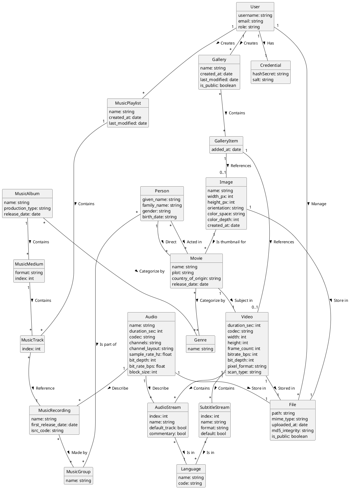
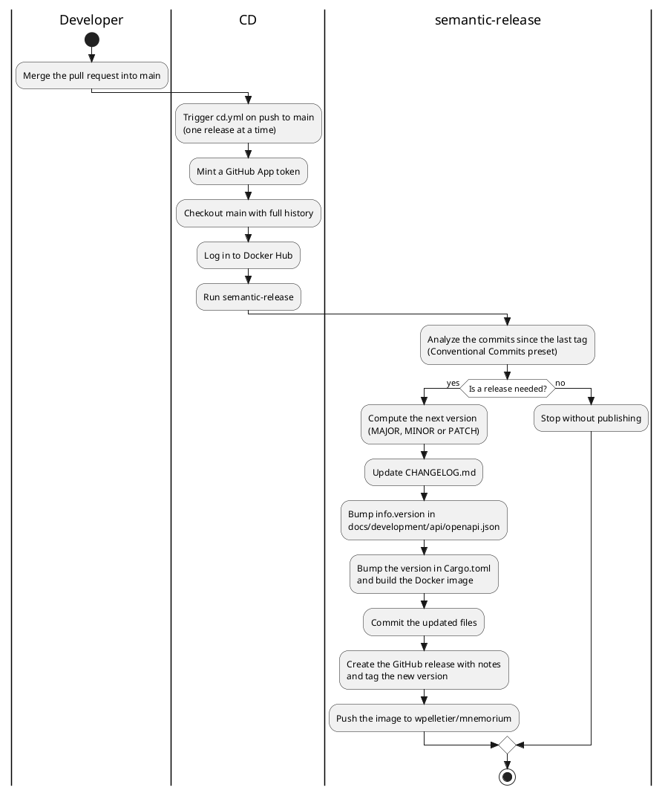

# Overview

## Source code structure

```text
└── src
    ├── bin
    │   ├── openapi_gen.rs
    │   └── server.rs
    └── lib
        ├── application
        │   ├── port
        │   └── use_case
        ├── domain
        │   ├── alias.rs
        │   ├── model
        │   ├── port
        │   │   └── error.rs
        │   └── service
        └── infrastructure
            ├── inbound
            │   └── rest
            │       ├── api_error.rs
            │       ├── app_state.rs
            │       ├── rest.rs
            │       ├── handler
            │       │   ├── asset
            │       │   ├── identity
            │       │   └── user
            │       └── middleware
            ├── logging.rs
            └── outbound
                ├── argon2
                ├── config
                ├── file_system
                ├── jwt
                ├── moka.rs
                ├── random
                └── sqlx
                    ├── model
                    └── sqlite3.rs
```

| Entity                                             | Description                                                               |
| -------------------------------------------------- | ------------------------------------------------------------------------- |
| `docs`                                             |                                                                           |
| `src`                                              |                                                                           |
| `src/bin`                                          |                                                                           |
| `src/bin/openapi_gen.rs`                           | Generate the OpenAPI specification to `docs/development/api/openapi.json` |
| `src/bin/server.rs`                                | Server entrypoint and graceful shutdown                                   |
| `src/lib`                                          |                                                                           |
| `src/lib/application`                              | App Layer                                                                 |
| `src/lib/application/port`                         | Interface declaration for usecase (one by file)                           |
| `src/lib/application/use_case`                     | Implementation of the **UseCase**                                         |
| `src/lib/domain`                                   | Domain Layer                                                              |
| `src/lib/domain/alias.rs`                          | Type alias for the project (ex: which integer to use for IDs)             |
| `src/lib/domain/model`                             | Aggregate, Entity, Value object declaration                               |
| `src/lib/domain/port`                              | Port interface declaration                                                |
| `src/lib/domain/port/error.rs`                     | Repository, External service error declaration                            |
| `src/lib/domain/service`                           | Domain Service implementation; see Terms Glossary for more info on it     |
| `src/lib/infrastructure/inbound/rest`              | HTTP adapter layer                                                        |
| `src/lib/infrastructure/inbound/rest/api_error.rs` | API Error declaration                                                     |
| `src/lib/infrastructure/inbound/rest/app_state.rs` | Shared application state injected into handlers                           |
| `src/lib/infrastructure/inbound/rest/rest.rs`      | Setup the axum routes and OpenAPI document                                |
| `src/lib/infrastructure/inbound/rest/handler`      | HTTP endpoint handler                                                     |
| `src/lib/infrastructure/inbound/rest/middleware`   | Axum middleware (authentication, tracing)                                 |
| `src/lib/infrastructure/outbound`                  | Outbound Port adapter declaration                                         |
| `src/lib/infrastructure/outbound/argon2`           | Argon2 password hasher adapter                                            |
| `src/lib/infrastructure/outbound/config`           | Configuration source adapters                                             |
| `src/lib/infrastructure/outbound/file_system`      | File storage adapter                                                      |
| `src/lib/infrastructure/outbound/jwt`              | JWT token provider adapter                                                |
| `src/lib/infrastructure/outbound/moka.rs`          | In-memory cache adapter                                                   |
| `src/lib/infrastructure/outbound/random`           | Password and secret generator adapters                                    |
| `src/lib/infrastructure/outbound/sqlx`             | SQLx/SQLite repository adapters                                           |
| `src/lib/infrastructure/outbound/sqlx/model`       | SQLx row models                                                           |
| `src/lib/infrastructure/outbound/sqlx/sqlite3.rs`  | SQLite pool initialization and migrations                                 |
| `src/lib/infrastructure/logging.rs`                | Logging related bootstrapping                                             |

## Server lifecycle

The server binary (`src/bin/server.rs`) shuts down gracefully on `SIGINT` and `SIGTERM`:

1. The signal stops the listener: new connections are refused.
2. In-flight requests drain to completion; idle keep-alive connections are closed.
3. `axum::serve` returns and the process exits with code `0`.

Because the `/health` endpoint starts failing as soon as the drain begins, orchestrators stop routing traffic to the
instance while existing requests finish.

The supervisor controls the hard termination window:

- **Docker**: `docker stop` sends `SIGTERM`, then `SIGKILL` after the grace period (default 10 s). Current endpoints
  complete well within it; raise the grace (`docker stop --time <seconds>`, or `stop_grace_period` in compose) once
  long-running uploads or media scans land.
- **systemd**: `KillSignal=SIGTERM` is the default; size `TimeoutStopSec` to the longest expected drain plus a margin
  for filesystem syncs (`TimeoutStopSec=120` is a safe starting point on networked storage).
- **launchd**: use `launchctl bootout` (sends `SIGTERM` and waits); avoid `launchctl kickstart -k`, which sends
  `SIGKILL` and truncates in-flight I/O.

## Domain model



| **Term**           | **Description**                                                                                                                                                                                                                                                                             |
| ------------------ | ------------------------------------------------------------------------------------------------------------------------------------------------------------------------------------------------------------------------------------------------------------------------------------------- |
| **Person**         | Fundamental identifying information representing an individual human being (e.g., real name, date of birth).                                                                                                                                                                                |
| **User**           | An account or actor actively interacting with the application.                                                                                                                                                                                                                              |
| **Credential**     | An authentication factor (e.g., password hash, API token, OAuth secret) used to verify a User's identity.                                                                                                                                                                                   |
| **MusicGroup**     | An entity representing a musical performer or ensemble, such as a band, orchestra, choir, or solo artist.                                                                                                                                                                                   |
| **MusicPlaylist**  | A user-created, ordered collection of **MusicRecording**.                                                                                                                                                                                                                                   |
| **MusicAlbum**     | A curated, top-level commercial or conceptual collection of **MusicRecording** by an **MusicGroup**.                                                                                                                                                                                        |
| **MusicMedium**    | The specific physical or digital container holding a sequence of **MusicTracks** (e.g., a specific CD, cassette tape, vinyl disc side, or digital volume).                                                                                                                                  |
| **MusicTrack**     | An ordered slot or position entry on a specific **MusicMedium** that points to an underlying **MusicRecording**.                                                                                                                                                                            |
| **MusicRecording** | A unique master audio capture or sound recording session, independent of the physical formats on which it is distributed.                                                                                                                                                                   |
| **Movie**          | A self-contained, long-form narrative or documentary film produced for artistic, cinematic, or entertainment purposes.                                                                                                                                                                      |
| **Video**          | An abstract domain representation of a video file                                                                                                                                                                                                                                           |
| **SubtitleStream** | A text data stream embedded within a video container that provides timed subtitle or caption text.                                                                                                                                                                                          |
| **AudioStream**    | A discrete audio track or channel stream embedded within a multi-stream media file.                                                                                                                                                                                                         |
| **Language**       | A standardized natural human language used for text, speech, or subtitle localization (e.g., ISO 639-1 code).                                                                                                                                                                               |
| **Genre**          | A categorical classification used to group media assets (e.g., **Movie**, **MusicAlbum**) by shared stylistic, thematic, or musical conventions.                                                                                                                                            |
| **File**           | A physical computer file stored within a file system or object storage.                                                                                                                                                                                                                     |
| **Image**          | An abstract domain representation of an image file                                                                                                                                                                                                                                          |
| **Gallery**        | An aggregated collection of visual assets, such as **ImageObjects** and **VideoObjects**. The first one is the default one containings all available **ImageObjects** and **VideoObjects** (other than movie). Deleting item in this **Gallery** will also delete permently from the system |
| **GalleryItem**    | A position-aware entry within a **Gallery** that references either an **ImageObject** or a **VideoObject**.                                                                                                                                                                                 |
| **Audio**          | An abstract domain representation of an audio file or a Audio Stream details                                                                                                                                                                                                                |

## Bounded context

| Name          | Description                                                               |
| ------------- | ------------------------------------------------------------------------- |
| Identity      | Authentication and identity validation                                    |
| User          | Managing user records, profiles, lifecycle, and administrative operations |
| Library       | User's collection of media                                                |
| Configuration | Manage service configuration                                              |
| Asset         | Manage files                                                              |

## Branch naming and PR title naming

PR titles follow the [Conventional Commits v1.0.0](https://www.conventionalcommits.org/en/v1.0.0/) specification: the
type at the start of the title determines the semantic version bump (see [Versioning](#versioning) below). The allowed
types are enforced by the semantic PR gating job in `.github/workflows/ci.yml` (`amannn/action-semantic-pull-request`).

### Branch naming

Format: `{type}({scope})/{description}`, kebab-case.

Examples:

- `feat(core)/serve-media`
- `fix(devops)/fix-dockerfile`
- `docs(agent)/spellcheck-dead`

### PR title naming

Format: `{type}({scope}): {description}` — enforced by CI.

For intentional breaking changes, add `!` after the type/scope:

- `feat(core)!: rename endpoints`
- `fix(core)!: change response schema`

Examples:

- `feat(core): serve media via streaming`
- `fix(devops): fix Dockerfile registry`
- `perf(application): speed up library scan`

### Docs-only PRs

A PR whose type is `docs` must only change documentation: files under `docs/`, any `*.md` file, or `mkdocs.yml`.
Anything else is rejected by the `docs-only` job in `.github/workflows/ci.yml`; use another type (for example `build` or
`chore`) for tooling or dependency updates.

### Scopes

A scope is an optional noun describing the area of the codebase affected. The allowed scopes are:

| Scope       | Description                                       |
| ----------- | ------------------------------------------------- |
| config      | Repository, tooling, and lint configuration files |
| agent       | opencode configuration, agents, and `AGENTS.md`   |
| devenv      | devenv environment files                          |
| github      | GitHub Actions workflows and configuration        |
| test-e2e    | End-to-end tests                                  |
| test-system | System tests                                      |
| sqlite3     | SQLite3 datastore (migrations, sqlx SQLite layer) |
| application | Application layer (use cases and ports)           |
| development | Development documentation                         |
| readme      | Repository `README.md` files                      |
| api         | REST API and OpenAPI specification                |

Other scopes may be added later as new areas emerge.

### Type prefixes

| Prefix   | Description                                  | Version bump |
| -------- | -------------------------------------------- | ------------ |
| feat     | New feature                                  | MINOR        |
| fix      | Bug fix (including production fixes)         | PATCH        |
| perf     | Performance improvement                      | PATCH        |
| refactor | Code cleanup/restructure, no behavior change | none         |
| docs     | Documentation changes                        | none         |
| test     | Tests and test improvements                  | none         |
| build    | Build system and dependency changes          | none         |
| ci       | CI/CD workflow changes                       | none         |
| chore    | Maintenance tasks                            | none         |

A `!` after the type/scope (or a `BREAKING CHANGE:` footer) marks a breaking change and bumps MAJOR regardless of type.

## Versioning

The version follows [semantic versioning](https://semver.org/) (`MAJOR.MINOR.PATCH`). It is computed automatically on
merge by [semantic-release](https://semantic-release.org/) from the commits since the last tag, using the
[Conventional Commits](https://www.conventionalcommits.org/en/v1.0.0/) preset:

| Bump  | Trigger                                                                |
| ----- | ---------------------------------------------------------------------- |
| MAJOR | A commit with a `!` marker or a `BREAKING CHANGE:` footer              |
| MINOR | At least one `feat` commit (and no breaking change)                    |
| PATCH | At least one `fix` or `perf` commit (and no `feat` or breaking change) |
| none  | `refactor`, `docs`, `test`, `build`, `ci`, and `chore` only            |

When a release is needed, the release workflow (`.github/workflows/cd.yml`) runs semantic-release, which:

1. Bumps the version in `Cargo.toml` and `docs/development/api/openapi.json`.
2. Builds the Docker image at the new version.
3. Commits `CHANGELOG.md`, `docs/development/api/openapi.json`, and `Cargo.toml` as `github-actions[bot]`.
4. Tags the commit (`v<version>`) and pushes it.
5. Publishes the GitHub release (with generated release notes) and pushes the Docker image.

### Release process

The release workflow (`.github/workflows/cd.yml`) runs when a pull request is merged into `main`:


