# Persistence

Mnemorium uses a single datastore: **SQLite3**, accessed through `sqlx`. The
schema is versioned by migrations in `migrations/` (one `.up.sql`/`.down.sql`
pair per change) and applied at startup by `sqlx::migrate!` in
`src/lib/infrastructure/outbound/sqlx/sqlite3.rs`.

## SQLite3

Migrations run at boot inside `init_db`. Besides the table schema they seed
reference data (`audio_channel`, `color`, `language`, `mime_type`) and install
triggers that enforce invariants:

- `user` row with `user_id = 0` (the Root Admin) cannot be deleted or modified.
- `gallery` row with `gallery_id = 0` (the default gallery) cannot be deleted or
  modified.
- `codec`, `genre_id`, and `movie.country_of_origin` are normalised to uppercase
  on insert/update.
- The `configuration` table is a singleton (`configuration_id = 0`) whose row
  cannot be deleted; it is created at first boot by the Initialize Configuration
  use case, which also generates the secrets.
- The `configuration.log_root_admin_password` flag records whether the Root
  Admin default password is still revealed on standard output; the Patch
  Credential use case clears it when the Root Admin replaces its own password.

```puml
@startuml

hide empty members

entity credential {
   * credential_id: INTEGER <<PK>>
   --
   * password_hash: TEXT <<NN, UN>>
   * updated_at: TEXT <<NN, DF(CURRENT_TIMESTAMP)>>
}

entity user {
   * user_id: INTEGER <<PK>>
   --
   * role: VARCHAR(50) <<NN, CC(role IN ('ADMIN', 'STANDARD'))>>
   * username: VARCHAR(100) <<NN, UN, CC(length(username) >= 4)>>
   * email: TEXT <<UN, CC(email LIKE '%_@_%._%')>>
   * credential_id: INTEGER <<FK, UN, NN>>
}

entity music_album {
   * music_album_id: INTEGER <<PK>>
   * name: TEXT <<NN>>
   * release_date: DATE <<NN>>
   production_type: VARCHAR(20) <<CC(production_type IN ('COMPILATION', 'DJMIX', 'DEMO', 'LIVE', 'MIXTAPE', 'REMIX', 'SOUNDTRACK', 'STUDIO'))>>
}

entity music_medium {
   * music_medium_id: INTEGER <<PK>>
   --
   * music_album_id: INTEGER <<FK, UN, NN>>
   * type: TEXT <<NN>>
   * medium_index: INTEGER <<NN, DF(1)>>
}

entity music_track {
   * music_track_id: INTEGER <<PK>>
   --
   * track_index: INTEGER <<NN, CC(track_index >= 0)>>
   * music_playlist_id: INTEGER <<FK>>
   * music_medium_id: INTEGER <<FK>>
   * music_recording_id: INTEGER <<FK, NN>>
}

entity music_recording {
   * music_recording_id: INTEGER <<PK>>
   --
   * name: TEXT
   * first_release_date: DATE <<NN>>
   * isrc_code: VARCHAR(12) <<UN>>
   * audio_id: INTEGER <<FK, NN>>
}

entity music_playlist {
   * music_playlist_id: INTEGER <<PK>>
   --
   * name: TEXT <<NN>>
   * created_at: TEXT <<NN, DF(CURRENT_TIMESTAMP)>>
   * user_id: INTEGER <<FK, NN>>
   * is_public: BOOLEAN <<NN, DF(1)>>
}

entity audio_channel {
   * audio_channel_id: TEXT <<PK>>
   --
   * nb_channel: INTEGER <<NN>>
   * description: TEXT <<NN>>
}

entity audio {
   * audio_id: INTEGER <<PK>>
   --
   * name: TEXT <<NN>>
   * duration_ms: REAL <<NN, CC(duration_ms >= 0)>>
   * codec: TEXT <<NN>>
   * sample_rate_hz: REAL <<NN, CC(sample_rate_hz >= 0)>>
   * audio_channel_id: TEXT <<FK, NN>>
   * bit_depth: INTEGER <<NN, CC(bit_depth > 0 AND (bit_depth & (bit_depth - 1)) = 0)>>
   * block_size: INTEGER <<NN, CC(block_size > 0 AND (block_size & (block_size - 1)) = 0)>>
   * file_id: INTEGER <<FK, NN, UN>>
}

entity genre {
   * genre_id: TEXT <<PK>>
}

entity music_recording_genre {
   * music_recording_id: INTEGER <<FK, PK>>
   * genre_id: TEXT <<FK, PK>>
}

entity music_album_genre {
   * music_album_id: INTEGER <<FK, PK>>
   * genre_id: TEXT <<FK, PK>>
}

entity movie_genre {
   * movie_id: INTEGER <<FK, PK>>
   * genre_id: TEXT <<FK, PK>>
}

entity music_group {
   * music_group_id: INTEGER <<PK>>
   --
   * stage_name: VARCHAR(50) <<NN, UN>>
}

entity person {
   * person_id: INTEGER <<PK>>
   --
   * given_name: VARCHAR(50) <<NN>>
   * family_name: VARCHAR(50)
   * birth_date: DATE
}

entity music_group_person {
   * music_group_id: INTEGER <<FK, PK>>
   * person_id: INTEGER <<FK, PK>>
}

entity music_recording_group {
   * music_recording_id: INTEGER <<FK, PK>>
   * music_group_id: INTEGER <<FK, PK>>
}

entity music_album_group {
   * music_album_id: INTEGER <<FK, PK>>
   * music_group_id: INTEGER <<FK, PK>>
}

entity file {
   * file_id: INTEGER <<PK>>
   --
   * path: TEXT <<NN, UN>>
   * user_id: INTEGER <<FK, NN>>
   * is_public: BOOLEAN <<NN, DF(0)>>
   * mime_type_id: TEXT <<FK, NN>>
   * uploaded_at: DATE <<NN, DF(date('now'))>>
   * md5_integrity: VARCHAR(128) <<NN, UN, CC(length(md5_integrity) = 128)>>
}

entity mime_type {
   * mime_type_id: TEXT <<PK>>
   * type: TEXT <<NN, CC(type IN ('AUDIO', 'VIDEO', 'IMAGE'))>>
}

entity video {
   * video_id: INTEGER <<PK>>
   --
   * duration_ms: REAL <<NN>>
   * codec: VARCHAR(20) <<NN>>
   * frame_count: INTEGER <<NN, CC(frame_count > 0)>>
   * width: INTEGER <<NN, CC(width > 0)>>
   * height: INTEGER <<NN, CC(height > 0)>>
   * color_id: TEXT <<FK, NN>>
   * scan_type: VARCHAR(20) <<NN, CC(scan_type IN ('PROGRESSIVE', 'INTERLACED', 'MBAFF', 'PAFF'))>>
   * file_id: INTEGER <<FK, NN, UN>>
}

entity movie {
   * movie_id: INTEGER <<PK>>
   --
   * name: TEXT <<NN>>
   * plot: TEXT <<NN>>
   * country_of_origin: VARCHAR(30) <<NN>>
   * release_date: DATE <<NN, DF(date('now'))>>
   * video_id: INTEGER <<FK, NN, UN>>
}

entity language {
   * language_id: INTEGER <<PK>>
   --
   * english_name: VARCHAR(50) <<NN, UN>>
   * native_name: VARCHAR(50) <<NN, UN>>
   * code: VARCHAR(2) <<NN, UN>>
}

entity stream {
   * stream_id: INTEGER <<PK>>
   --
   * stream_index: INTEGER <<NN>>
   * name: TEXT <<NN>>
   * is_default: BOOLEAN <<NN, DF(0)>>
   * video_id: INTEGER <<FK, NN>>
}

entity audio_stream {
   * stream_id: INTEGER <<FK, PK>>
   --
   * is_commentary: BOOLEAN <<NN, DF(0)>>
   * audio_id: INTEGER <<FK, NN>>
   * language_id: INTEGER <<FK, NN>>
}

entity subtitle_stream {
   * stream_id: INTEGER <<FK, PK>>
   --
   * is_forced: BOOLEAN <<NN, DF(0)>>
   * language_id: INTEGER <<FK, NN>>
}

entity image {
   * image_id: INTEGER <<PK>>
   --
   * name: TEXT <<NN>>
   * width_px: INTEGER <<NN, CC(width_px > 0)>>
   * height_px: INTEGER <<NN, CC(height_px > 0)>>
   * orientation: VARCHAR(20) <<NN, CC(orientation IN ('LANDSCAPE', 'PORTRAIT', 'SQUARE'))>>
   * created_at: DATE <<NN>>
   * color_id: TEXT <<FK, NN>>
}

entity color {
   * color_id: TEXT <<PK>>
   --
   * description: TEXT <<NN>>
}

entity gallery {
   * gallery_id: INTEGER <<PK>>
   --
   * name: TEXT <<NN>>
   * created_at: TEXT <<NN>>
   * last_modified_at: TEXT <<NN>>
   * is_public: BOOLEAN <<NN>>
}

entity gallery_item {
   * gallery_id: INTEGER <<FK, PK, NN>>
   * image_id: INTEGER <<FK, PK, NN>>
   * item_index: INTEGER <<PK, NN>>
   --
   * added_at: TEXT <<NN, DF(CURRENT_TIMESTAMP)>>
}

entity gallery_video {
   * gallery_id: INTEGER <<FK, PK, NN>>
   * video_id: INTEGER <<FK, PK, NN>>
   * item_index: INTEGER <<PK, NN>>
   --
   * added_at: TEXT <<NN, DF(CURRENT_TIMESTAMP)>>
}

entity configuration {
    * configuration_id: INTEGER <<PK, CC(configuration_id = 0)>>
    --
    * jwt_secret: TEXT <<NN, CC(length(jwt_secret) = 64)>>
    * jwt_ttl: INTEGER <<NN, CC(jwt_ttl > 0)>>
    * pepper: TEXT <<NN, CC(length(pepper) = 64)>>
    * log_root_admin_password: INTEGER <<NN, DF(1), CC(log_root_admin_password IN (0, 1))>>
    * sqlite3_path: TEXT <<NN>>
    * sqlite3_max_connections: INTEGER <<NN, CC(sqlite3_max_connections > 0)>>
}

user ||--|| credential
user ||--o{ music_playlist
user ||--o{ file

music_album ||--o{ music_medium
music_album ||--o{ music_album_genre
music_album ||--o{ music_album_group

music_medium ||--o{ music_track

music_playlist ||--o{ music_track

music_track ||--|| music_recording

audio_channel ||--o{ audio

audio ||--|| music_recording
audio ||--|| file

music_recording ||--o{ music_recording_genre
music_recording ||--o{ music_recording_group

genre ||--o{ music_album_genre
genre ||--o{ music_recording_genre
genre ||--o{ movie_genre

mime_type ||--o{ file

music_group ||--o{ music_group_person
music_group ||--o{ music_recording_group
music_group ||--o{ music_album_group

person ||--o{ music_group_person

video ||--|| file
video ||--|| color

movie ||--|| video
movie ||--o{ movie_genre

stream ||--o{ audio_stream
stream ||--o{ subtitle_stream

audio_stream ||--|| audio
language ||--o{ audio_stream
language ||--o{ subtitle_stream

image ||--|| color

gallery ||--o{ gallery_item
gallery ||--o{ gallery_video

gallery_item ||--|| image
gallery_video ||--|| video

@enduml
```

### Legend

| Decorator | Description      |
| --------- | ---------------- |
| PK        | Primary Key      |
| FK        | Foreign Key      |
| NN        | NOT NULL         |
| UN        | UNIQUE           |
| CC        | CHECK constraint |
| DF        | DEFAULT value    |
