# Technical Design Document

**Status** — living document. This is the canonical reference for how Mnemorium is designed and built: code style,
architecture, API contract, persistence, testing, and dependencies. It binds production code, tests, migrations, and
documentation.

This is not a feature specification: what a feature _does_ belongs in an issue or a use case (see
[UseCases.md](UseCases.md)); how the codebase _must be shaped_ belongs here. When code and this document disagree, fix
one of them in the same change — never let them drift apart.

---

## Purpose

The audience is everyone who changes the backend: maintainers, review agents, and implementation agents. Rules here are
written to be cited and checked.

---

## How this document is extended

---

### Section registry

| #   | Section                        | Status   | Canonical source           | Owner                                     |
| --- | ------------------------------ | -------- | -------------------------- | ----------------------------------------- |
| 1   | Code Style Guidelines          | migrated | —                          | rust-dev (Rust), database-engineer (SQL)  |
| 2   | Architecture                   | linked   | [Overview.md](Overview.md) | —                                         |
| 3   | API                            | migrated | —                          | rust-dev                                  |
| 4   | Persistence                    | migrated | —                          | database-engineer                         |
| 5   | Testing                        | migrated | —                          | rust-dev (unit/integration), qa-e2e (E2E) |
| 6   | Dependencies & Dev Environment | migrated | —                          | devops                                    |

Rule-ID prefixes: § 1 `STY-*`, § 2 `ARCH-*`, § 3 `API-*`, § 4 `PERS-*`, § 5 `TEST-*`, § 6 `DEPS-*`.

- **migrated** — the content lives in this document.
- **linked** — the section number is reserved; the canonical content still lives in the linked document and migrates
  here later.
- **planned** — no content exists yet; the number is reserved.

---

### Section anatomy

Each section states:

1. **Purpose** — one short paragraph: what the section governs.
2. **Rules** — the normative statements, one per row of the [rule table](#rule-model).
3. **Details** — the numbered sections after the table that hold code, examples and reference material.
4. **References** — links to adjacent documents or external sources.

---

### Rule model

A section presents its rules as a **rule table**:

| ID             | Section | Rule                                                                                   | More info |
| -------------- | ------- | -------------------------------------------------------------------------------------- | --------- |
| `STY-RUST-001` | General | Extract functionality into its own function only when it is used in at least 4 places. |           |

- **ID** — a permanent, append-only identifier (`STY-RUST-001`, `STY-SQL-001`, ...). Never renumber, reuse, or delete
  one; retire it in place.
- **Section** — the topic the rule belongs to.
- **Rule** — one line, imperative and testable.
- **More info** — a link to the numbered detail section below the table that holds the rule's code, rationale or
  reference material; empty when the rule is self-contained.

The numbered detail sections that follow the table carry everything non-normative: code, examples, tables and
explanation. They are numbered `#### 1.`, `#### 2.`, nested `##### 2.1`, and so on, restarting at 1 within each `###`
group; like rule IDs, detail numbers are append-only.

Only normative statements carry IDs; every section present in this document uses the table form. A newly added or
migrated section follows the same shape.

Cite a rule as `TechnicalDesign.md § 1 (Code Style Guidelines), STY-RUST-001`, or a detail section by its number, e.g.
`§ 2.6`.

---

### Adding or migrating a section

1. Take the next number in the registry; numbers are never reused.
2. Write the section following the [section anatomy](#section-anatomy), or mark it `linked` with a pointer to its
   canonical source.
3. To migrate: move the content, re-level its headings under the section, keep every existing anchor working, then
   delete the source document and update every reference — including `AGENTS.md` and `mkdocs.yml` — in the same change.
4. Assign the section's rule-ID prefix in this file.
5. Run the Markdown gates: the `markdownlint` and `markdownfmt` tools.

---

## Code Style Guidelines

---

### Rust

Rules are grouped in the table below; the numbered detail sections that follow hold their code, rationale and reference
material. The `#[utoipa::path(...)]` declaration contract lives in the [API section](#api).

| ID             | Section           | Rule                                                                                                                                                                                                                                                                                                                                                            | More info                                                        |
| -------------- | ----------------- | --------------------------------------------------------------------------------------------------------------------------------------------------------------------------------------------------------------------------------------------------------------------------------------------------------------------------------------------------------------- | ---------------------------------------------------------------- |
| `STY-RUST-001` | General           | Extracting functionality from a function into its own function should only be done when that functionality is used in at least 4 different places. This applies to production code; shared test fixtures are exempt.                                                                                                                                            |                                                                  |
| `STY-RUST-072` | Application state | `src/bin/server.rs` is the composition root: the only place that instantiates concrete adapters and builds `AppState`.                                                                                                                                                                                                                                          | [§ 1](#1-application-state)                                      |
| `STY-RUST-073` | Application state | Nothing outside the composition root constructs a concrete adapter.                                                                                                                                                                                                                                                                                             | [§ 1](#1-application-state)                                      |
| `STY-RUST-074` | Application state | `AppState` is the single router state; `FromRef` impls expose exactly what middleware extracts, and getters return `Arc` clones, never borrows.                                                                                                                                                                                                                 | [§ 1](#1-application-state)                                      |
| `STY-RUST-002` | REST handlers     | Split the handler directory (`src/lib/infrastructure/inbound/rest/handler`) into subdirectories, one folder per bounded context.                                                                                                                                                                                                                                |                                                                  |
| `STY-RUST-003` | REST handlers     | Each file contains exactly one endpoint.                                                                                                                                                                                                                                                                                                                        |                                                                  |
| `STY-RUST-004` | REST handlers     | A handler extracts `State<AppState>` and resolves its use case through the bounded context's factory (`state.<context>_use_case_factory().<use_case>()`) before calling `execute`; it never receives a pre-built use case.                                                                                                                                      |                                                                  |
| `STY-RUST-005` | REST handlers     | File name is `<method>_<context>.rs`, e.g. `post_note.rs`, `get_note.rs`.                                                                                                                                                                                                                                                                                       |                                                                  |
| `STY-RUST-006` | REST handlers     | The handler function is named like the file name, e.g. `post_note`, `get_note`.                                                                                                                                                                                                                                                                                 |                                                                  |
| `STY-RUST-007` | REST handlers     | Declare the request body object first (only for methods that carry a body: `POST`, `PUT`, `PATCH`).                                                                                                                                                                                                                                                             |                                                                  |
| `STY-RUST-008` | REST handlers     | Declare the query object second.                                                                                                                                                                                                                                                                                                                                |                                                                  |
| `STY-RUST-009` | REST handlers     | Declare the response body object third.                                                                                                                                                                                                                                                                                                                         |                                                                  |
| `STY-RUST-010` | REST handlers     | Declare the use-case-error-to-`ApiError` mapping fourth.                                                                                                                                                                                                                                                                                                        |                                                                  |
| `STY-RUST-011` | REST handlers     | Declare the endpoint handler last.                                                                                                                                                                                                                                                                                                                              |                                                                  |
| `STY-RUST-012` | REST handlers     | Query parameters: struct named `<Context>Query`, deriving `Serialize`, `Deserialize`, `IntoParams`.                                                                                                                                                                                                                                                             |                                                                  |
| `STY-RUST-013` | REST handlers     | Request body: struct named `<Context>Request`, deriving `Serialize`, `Deserialize`, `ToSchema`.                                                                                                                                                                                                                                                                 |                                                                  |
| `STY-RUST-014` | REST handlers     | Response body: struct named `<Context>Response`, deriving `Serialize`, `Deserialize`, `ToSchema`.                                                                                                                                                                                                                                                               |                                                                  |
| `STY-RUST-015` | REST handlers     | Even when a payload has a single attribute, always prefer a struct over a raw return/parameter/query value.                                                                                                                                                                                                                                                     |                                                                  |
| `STY-RUST-016` | Error handling    | **`ApiError`** — declared in `src/lib/infrastructure/inbound/rest/api_error.rs`. Its variants map one to one to HTTP status codes (e.g. `Conflict`, `BadRequest`, `InternalServerError`). It is **not** derived with `thiserror`; it is an HTTP transport concern, not a domain error.                                                                          | [§ 2.4](#24-apierror-to-axum-response)                           |
| `STY-RUST-017` | Error handling    | **Domain error** — for failure when initialising or updating a domain model. Declared **before the model struct, in the same file** as the model, e.g. in `src/lib/domain/model/user.rs`.                                                                                                                                                                       | [§ 2.1](#21-domain-error)                                        |
| `STY-RUST-018` | Error handling    | **Use Case error** — one enum per use case, declared in `src/lib/application/port`, with an `Unknown(_)` variant and an invalid-parameter variant.                                                                                                                                                                                                              | [§ 2.2](#22-use-case-error)                                      |
| `STY-RUST-019` | Error handling    | **`thiserror`** is used for the **Use Case**, **Domain**, and **Port** error enums. It is **not** used for `ApiError`.                                                                                                                                                                                                                                          |                                                                  |
| `STY-RUST-020` | Error handling    | **Port errors** (Repository, External Service) are declared in `src/lib/domain/port/error.rs`. They do **not** map directly to a use-case error; the use case translates them.                                                                                                                                                                                  | [§ 2.6](#26-port-errors)                                         |
| `STY-RUST-021` | Error handling    | **A missing entity is not an outbound-port error.** At an outbound port (Repository, External Service), a missing entity is a valid outcome: return `Option`/`None` (or a corresponding non-error type) — never a port error variant. A repository expresses absence as an empty `search` result or `Ok(false)` from `delete`; see [Repository](#8-repository). | [§ 2.6](#26-port-errors)                                         |
| `STY-RUST-022` | Error handling    | **Use-case errors may model absence.** Above the outbound port, a use case may legitimately report a missing entity as an error variant (e.g. `NoSuchUser`, `UnknownCredential`) so the inbound boundary can map it to a transport status such as `404 Not Found`. The "not an error" rule applies to outbound ports only, not to use-case errors.              | [§ 2.6](#26-port-errors)                                         |
| `STY-RUST-026` | Error handling    | Map only the variants that mean _the caller is unauthenticated_ (for example `InvalidClaims`, `InvalidToken`, `TokenExpired`) to a client error. Every other variant — including `OperationFailed` and `Unknown` — maps to `500` and is logged at `error`.                                                                                                      | [§ 2.7](#27-inbound-middleware)                                  |
| `STY-RUST-027` | Error handling    | Match the port error exhaustively. Port errors are `#[non_exhaustive]`, so end the match with a catch-all arm that defaults to `500`; never let a wildcard arm collapse a server-side failure into a misleading `401`.                                                                                                                                          | [§ 2.7](#27-inbound-middleware)                                  |
| `STY-RUST-023` | Domain models     | **Constructor**: `new` when infallible, `try_new` when it can fail; it returns `Result<Self, _>` and performs validation.                                                                                                                                                                                                                                       | [§ 3.1](#31-getter-and-setter)                                   |
| `STY-RUST-024` | Domain models     | **Getter**: `<field>(&self) -> <field type>`. Return a borrowed reference (`&str`, `Option<&str>`) or a `Copy` value type — never an owned clone.                                                                                                                                                                                                               | [§ 3.1](#31-getter-and-setter)                                   |
| `STY-RUST-025` | Domain models     | **Setter**: `set_<field>(&mut self, <value>)`. Return `Result<(), _>` when the field is validated, `()` otherwise.                                                                                                                                                                                                                                              | [§ 3.1](#31-getter-and-setter)                                   |
| `STY-RUST-028` | SQL data models   | Name the enum after the attribute it represents, in `UpperCamelCase`, e.g. `Role` for the `role` column of table `user` used in model `User`.                                                                                                                                                                                                                   | [§ 4.1](#41-enum-for-a-check-constraint)                         |
| `STY-RUST-029` | SQL data models   | Derive `sqlx::Type` with `#[sqlx(rename_all = "UPPERCASE")]` to match the uppercase constraint strings required by the SQL section.                                                                                                                                                                                                                             | [§ 4.1](#41-enum-for-a-check-constraint)                         |
| `STY-RUST-030` | SQL data models   | Name variants in `UpperCamelCase`, one per allowed constraint value.                                                                                                                                                                                                                                                                                            | [§ 4.1](#41-enum-for-a-check-constraint)                         |
| `STY-RUST-031` | Testing           | Name tests `<UnitOfWork>_<Scenario>_<ExpectedResult>`, e.g. `apply_discount_code_valid_code_reduces_total_price`.                                                                                                                                                                                                                                               | [§ 5](#5-testing)                                                |
| `STY-RUST-032` | Testing           | Follow the Arrange–Act–Assert (AAA) pattern.                                                                                                                                                                                                                                                                                                                    | [§ 5](#5-testing)                                                |
| `STY-RUST-033` | Testing           | Do not over-abstract test setup into deeply nested helper functions or distant global state.                                                                                                                                                                                                                                                                    | [§ 5](#5-testing)                                                |
| `STY-RUST-034` | Testing           | Keep tests deterministic and linear: no control flow (`if`, `match`, loops) inside a test function.                                                                                                                                                                                                                                                             | [§ 5](#5-testing)                                                |
| `STY-RUST-035` | Testing           | Prefer data-driven tests with `rstest` when possible.                                                                                                                                                                                                                                                                                                           | [§ 5](#5-testing)                                                |
| `STY-RUST-036` | Testing           | Use `#[fixture]` functions when a test case input is a struct.                                                                                                                                                                                                                                                                                                  | [§ 5](#5-testing)                                                |
| `STY-RUST-075` | Ports             | Always declare outbound port traits as `Send + Sync`.                                                                                                                                                                                                                                                                                                           | [§ 6.1](#61-port-traits-are-send-and-sync)                       |
| `STY-RUST-076` | Ports             | Outbound ports that return `impl Future` are not dyn-safe: hold concrete adapters and `Arc<dyn <UseCaseName>UseCase>` trait objects, never `Arc<dyn UnitOfWorkFactory>` or `Arc<dyn TokenProvider>`.                                                                                                                                                            | [§ 6.2](#62-dyn-safety)                                          |
| `STY-RUST-077` | Ports             | Repository methods mutate the shared transaction: take `&mut self` and return an explicitly `Send` future.                                                                                                                                                                                                                                                      | [§ 6.3](#63-async-methods-take-mut-self-and-return-send-futures) |
| `STY-RUST-078` | Ports             | Outbound port traits are `'static`; implementations may borrow, but never store a repository beyond the use-case `execute` that obtained it.                                                                                                                                                                                                                    | [§ 6.4](#64-port-traits-are-static-implementations-may-borrow)   |
| `STY-RUST-079` | Ports             | Prefer sharing long-lived adapters through `Arc<T>` over adding `Clone`.                                                                                                                                                                                                                                                                                        | [§ 6.5](#65-prefer-arc-over-clone)                               |
| `STY-RUST-037` | Unit of Work      | `commit` and `rollback` consume the unit of work.                                                                                                                                                                                                                                                                                                               | [§ 7.1](#71-lifecycle)                                           |
| `STY-RUST-038` | Unit of Work      | A rollback failure is logged and the **original** business error is returned.                                                                                                                                                                                                                                                                                   | [§ 7.1](#71-lifecycle)                                           |
| `STY-RUST-039` | Unit of Work      | A commit failure maps to the use-case `Unknown(_)`.                                                                                                                                                                                                                                                                                                             | [§ 7.1](#71-lifecycle)                                           |
| `STY-RUST-040` | Unit of Work      | Repository views borrow the unit of work mutably; drop them before `commit`/`rollback`.                                                                                                                                                                                                                                                                         | [§ 7.1](#71-lifecycle)                                           |
| `STY-RUST-041` | Unit of Work      | Repository accessors return a short-lived view that borrows the unit of work.                                                                                                                                                                                                                                                                                   | [§ 7.2](#72-context-views)                                       |
| `STY-RUST-042` | Unit of Work      | A context view exposes only its own context's repositories.                                                                                                                                                                                                                                                                                                     | [§ 7.2](#72-context-views)                                       |
| `STY-RUST-043` | Unit of Work      | Repositories are obtained **only** from a unit of work; concrete sqlx adapters never leave infrastructure.                                                                                                                                                                                                                                                      | [§ 7.2](#72-context-views)                                       |
| `STY-RUST-044` | Unit of Work      | Every repository comes from the **same** unit of work (one `begin()`); opening a second unit of work would be a second transaction and break atomicity.                                                                                                                                                                                                         | [§ 7.3](#73-cross-context-use-cases)                             |
| `STY-RUST-045` | Unit of Work      | Cross-context writes stay atomic: Register User (Identity + User), Delete User Account (Identity + User + Library + Asset; see [UseCases.md](UseCases.md)).                                                                                                                                                                                                     | [§ 7.3](#73-cross-context-use-cases)                             |
| `STY-RUST-046` | Unit of Work      | Each accessor borrows `&mut self`, so repositories are requested **sequentially**, never held two at a time.                                                                                                                                                                                                                                                    | [§ 7.3](#73-cross-context-use-cases)                             |
| `STY-RUST-047` | Unit of Work      | Declare the `UnitOfWork` trait first in `domain/port/unit_of_work.rs`.                                                                                                                                                                                                                                                                                          | [§ 7.4](#74-declaration-order-in-the-unit-of-work-port-file)     |
| `STY-RUST-048` | Unit of Work      | Declare the `UnitOfWorkFactory` trait second in `domain/port/unit_of_work.rs`.                                                                                                                                                                                                                                                                                  | [§ 7.4](#74-declaration-order-in-the-unit-of-work-port-file)     |
| `STY-RUST-049` | Repository        | `create` inserts a new aggregate and never binds identity columns: the datastore auto-increments them and `create` returns the aggregate with its final identifier.                                                                                                                                                                                             | [§ 8.1](#81-repository-port)                                     |
| `STY-RUST-050` | Repository        | `save` upserts an existing aggregate targeted by its identifier.                                                                                                                                                                                                                                                                                                | [§ 8.1](#81-repository-port)                                     |
| `STY-RUST-051` | Repository        | `delete` returns `Ok(false)` when no row matched; a missing entity is not an error.                                                                                                                                                                                                                                                                             | [§ 8.1](#81-repository-port)                                     |
| `STY-RUST-052` | Repository        | `search` returns an empty collection when nothing matches.                                                                                                                                                                                                                                                                                                      | [§ 8.1](#81-repository-port)                                     |
| `STY-RUST-053` | Repository        | Missing entities are never errors (see [Port error](#26-port-errors)).                                                                                                                                                                                                                                                                                          | [§ 8.1](#81-repository-port)                                     |
| `STY-RUST-054` | Repository        | It holds the transaction it operates on (`&'transaction mut Transaction<'static, Sqlite>` for SQLite) and is built by the unit-of-work accessor — never with a connection pool.                                                                                                                                                                                 | [§ 8.2](#82-repository-adapter)                                  |
| `STY-RUST-055` | Repository        | It maps `sqlx::Error` to `RepositoryError` in `error_mapping.rs`; sqlx types never cross into the domain or application layers.                                                                                                                                                                                                                                 | [§ 8.2](#82-repository-adapter)                                  |
| `STY-RUST-056` | Repository        | Declare the filter struct (e.g. `UserFilter`) first in a repository port file.                                                                                                                                                                                                                                                                                  | [§ 8.3](#83-declaration-order-in-a-repository-port-file)         |
| `STY-RUST-057` | Repository        | Declare the repository trait second in a repository port file.                                                                                                                                                                                                                                                                                                  | [§ 8.3](#83-declaration-order-in-a-repository-port-file)         |
| `STY-RUST-058` | Use cases         | A use case trait has one and only one method, named `execute`.                                                                                                                                                                                                                                                                                                  |                                                                  |
| `STY-RUST-059` | Use cases         | Trait named `<UseCaseName>UseCase`, e.g. `CreateNoteUseCase`.                                                                                                                                                                                                                                                                                                   |                                                                  |
| `STY-RUST-060` | Use cases         | Implementation named just `<UseCaseName>`, e.g. `CreateNote`.                                                                                                                                                                                                                                                                                                   |                                                                  |
| `STY-RUST-061` | Use cases         | Declare the command object first in a use-case port file.                                                                                                                                                                                                                                                                                                       | [§ 9.1](#91-declaration-order-in-a-use-case-port-file)           |
| `STY-RUST-062` | Use cases         | Declare the response object second in a use-case port file (only when non-empty).                                                                                                                                                                                                                                                                               | [§ 9.1](#91-declaration-order-in-a-use-case-port-file)           |
| `STY-RUST-063` | Use cases         | Declare the error enum third in a use-case port file.                                                                                                                                                                                                                                                                                                           | [§ 9.1](#91-declaration-order-in-a-use-case-port-file)           |
| `STY-RUST-064` | Use cases         | Declare the use-case trait last in a use-case port file.                                                                                                                                                                                                                                                                                                        | [§ 9.1](#91-declaration-order-in-a-use-case-port-file)           |
| `STY-RUST-065` | Use cases         | **Port** — `src/lib/application/port/<context>_use_case_factory.rs`. The trait is named `<Context>UseCaseFactory`, is `Send + Sync`, carries `#[cfg_attr(test, mockall::automock)]`, and exposes one method per use case — named after the use case — returning `Arc<dyn <UseCaseName>UseCase>`.                                                                | [§ 9.2](#92-use-case-factory)                                    |
| `STY-RUST-066` | Use cases         | **Adapter** — `src/lib/infrastructure/use_case_factory/<context>.rs`. The struct is named `Runtime<Context>UseCaseFactory` and holds what the context's use cases need: the live configuration (`Arc<ArcSwap<Configuration>>`) when they read it, and the unit-of-work factory (`Arc<SqlxUnitOfWorkFactory>`).                                                  | [§ 9.2](#92-use-case-factory)                                    |
| `STY-RUST-067` | Use cases         | **Lazy instantiation** — every accessor builds the use case on the spot and rebuilds its configuration-derived adapters (password hasher, token provider) from the live configuration; never cache those adapters.                                                                                                                                              | [§ 9.2](#92-use-case-factory)                                    |
| `STY-RUST-068` | Use cases         | The factory only supplies the unit-of-work factory; the use case still opens, commits and rolls back its own unit of work (see [Unit of Work](#7-unit-of-work)).                                                                                                                                                                                                | [§ 9.2](#92-use-case-factory)                                    |
| `STY-RUST-069` | Configuration     | `LoadConfiguration` runs once at startup; the resulting `Configuration` is stored as `Arc<ArcSwap<Configuration>>` in `AppState`.                                                                                                                                                                                                                               | [§ 10](#10-configuration)                                        |
| `STY-RUST-070` | Configuration     | Never cache a configuration-derived value (pepper, `JWT` secret, TTL) in a long-lived adapter built at startup; read it from the live configuration.                                                                                                                                                                                                            | [§ 10](#10-configuration)                                        |
| `STY-RUST-071` | Configuration     | Keep the bootstrap sources and their order identical to `ConfigConfigurationSource`.                                                                                                                                                                                                                                                                            | [§ 10](#10-configuration)                                        |
| `STY-RUST-080` | Configuration     | The `logging` section drives the runtime logs; install the subscriber once, after `LoadConfiguration`, because the configuration lives behind the datastore.                                                                                                                                                                                                    | [§ 10](#10-configuration)                                        |

---

#### 1. Application state

`src/bin/server.rs` is the composition root: it is the only place that instantiates concrete adapters, runs the startup
use cases (`LoadConfiguration`, `InitializeRootAdmin`) and builds the `AppState` the HTTP layer shares.

`AppState` lives in `src/lib/infrastructure/inbound/rest/app_state.rs` and holds:

- the live configuration (`Arc<ArcSwap<Configuration>>`),
- the per-context use-case factories (see [Use cases](#9-use-cases)),
- the token provider the auth middleware validates with.

`AppState` is the single router state; `FromRef` impls expose exactly what middleware extracts from it. Getters return
`Arc` clones, never borrows of the shared state. Nothing outside the composition root constructs a concrete adapter.

---

#### 2. Error handling

Errors follow a layered model: one error type per role, each translating to the next as it crosses an architectural
boundary.

---

##### 2.1 Domain error

Declare the error enum before the model struct, in the same file. It reports failures when initialising or updating a
domain model.

```rust
#[derive(Debug, thiserror::Error)]
pub enum CreateUserError {
    #[error("email has an invalid format")]
    InvalidEmail,
    #[error("an unknown error occurred: {0}")]
    Unknown(#[source] anyhow::Error),
}

pub struct User {
    // ...
}
```

---

##### 2.2 Use Case error

Declared in `src/lib/application/port`, it always exposes an `Unknown(_)` variant and one or more invalid-parameter
variants.

```rust
#[derive(Debug, thiserror::Error)]
pub enum CreateUserError {
    #[error("a user with this email already exists")]
    UserAlreadyExists,
    #[error("email has an invalid format")]
    InvalidEmail,
    #[error("an unknown error occurred: {0}")]
    Unknown(#[source] anyhow::Error),
}
```

A use-case error may also carry a not-found variant (e.g. `NoSuchUser`, `UnknownCredential`) that the REST handler maps
to `ApiError::NotFound`; only outbound ports must express absence as a value, not an error (see
[Port errors](#26-port-errors)).

---

##### 2.3 Mapping use-case error to API error

Each rest handler file declares the mapping from its use-case error to the `ApiError`:

```rust
impl From<CreateUserError> for ApiError {
    fn from(err: CreateUserError) -> Self {
        match err {
            CreateUserError::UserAlreadyExists => ApiError::Conflict,
            CreateUserError::InvalidEmail => ApiError::BadRequest,
            CreateUserError::Unknown(_) => ApiError::InternalServerError,
        }
    }
}
```

---

##### 2.4 ApiError to axum response

`ApiError` implements `IntoResponse`, converting to the corresponding HTTP status code and the standard error body.

---

##### 2.5 Error public payload

Every error response carries the same body:

```json
{
  "error": "An error message"
}
```

---

##### 2.6 Port errors

Port errors are translated into use-case errors by the use case, never consumed directly by the HTTP adapter — the one
exception being inbound middleware (see [Inbound middleware](#27-inbound-middleware)).

Besides the two shared families below (Repository, External Service), a port may declare its **own** error family in
`src/lib/domain/port/error.rs`. Every port error exposes at least an `Unknown(anyhow::Error)` variant.

###### 2.6.1 Repository

| Error                  | Description                                                                                                               |
| ---------------------- | ------------------------------------------------------------------------------------------------------------------------- |
| AlreadyExist           | The entity already exists and cannot be created again. Typically caused by duplicate business keys or unique constraints. |
| Conflict               | The operation cannot be completed because the current state of the data conflicts with the requested action.              |
| ConcurrencyConflict    | The operation failed due to a concurrent modification of the same entity (for example, optimistic locking failure).       |
| DataIntegrityViolation | The operation would violate a data integrity rule or constraint.                                                          |
| ValidationFailed       | The provided data does not satisfy validation rules required by the repository.                                           |
| OperationFailed        | The repository could not complete the requested operation for a non-specific reason.                                      |
| Timeout                | The operation exceeded the allowed execution time.                                                                        |
| Unavailable            | The repository or underlying datastore is currently unavailable.                                                          |
| Unknown                | An unexpected or unmapped error occurred.                                                                                 |

###### 2.6.2 External Service

| Error                  | Description                                                                                  |
| ---------------------- | -------------------------------------------------------------------------------------------- |
| Unauthorized           | Authentication is required or the provided credentials are invalid.                          |
| Forbidden              | The caller is authenticated but does not have permission to perform the requested operation. |
| RateLimited            | The external service rejected the request because a usage limit was exceeded.                |
| Timeout                | The external service did not respond within the expected time.                               |
| Unavailable            | The external service is temporarily unavailable or unreachable.                              |
| CommunicationFailure   | A network, protocol, or transport-level error occurred while communicating with the service. |
| SerializationFailure   | The request could not be properly serialized before being sent to the service.               |
| DeserializationFailure | The service response could not be parsed or converted into the expected format.              |
| InvalidRequest         | The request was rejected because it contains invalid or missing information.                 |
| DependencyFailure      | The service failed due to a problem with one of its own dependencies.                        |
| RetryableFailure       | A transient error occurred and the operation may succeed if retried.                         |
| Unknown                | An unexpected or unmapped error occurred.                                                    |

###### 2.6.3 Unit of Work

| Error           | Description                                                    |
| --------------- | -------------------------------------------------------------- |
| OperationFailed | The unit of work could not complete for a non-specific reason. |
| Unavailable     | The datastore is currently unavailable.                        |
| Unknown         | An unexpected or unmapped error occurred.                      |

###### 2.6.4 Configuration Source

| Error                | Description                                                           |
| -------------------- | --------------------------------------------------------------------- |
| InvalidConfiguration | The layered settings do not form a valid configuration.               |
| OperationFailed      | The configuration source could not be read for a non-specific reason. |
| Unknown              | An unexpected or unmapped error occurred.                             |

---

##### 2.7 Inbound middleware

Inbound middleware may consume a port directly when that port's decision is the middleware's own responsibility — for
example, `authenticate` calls `TokenProvider` to decide whether to admit a request. Two rules apply.

---

#### 3. Domain models

---

##### 3.1 Getter and setter

Accessors are named after the field they expose.

```rust
impl User {
    pub fn try_new(username: String) -> Result<Self, UserError> {
        let username = Self::validate_username(username)?;
        Ok(Self { username })
    }

    #[must_use]
    pub fn username(&self) -> &str {
        &self.username
    }

    pub fn set_username(&mut self, username: String) -> Result<(), UserError> {
        self.username = Self::validate_username(username)?;
        Ok(())
    }
}
```

Note: reject-invalid-then-assign. A setter validates the new value, assigns only on success, and reports the cause
through the domain error enum when it fails.

---

#### 4. SQL data models

---

##### 4.1 Enum for a CHECK constraint

For a column backed by a SQL `CHECK (... IN (...))` constraint, declare the Rust enum **before** the model struct, in
the same file.

```rust
#[derive(Debug, Clone, Copy, PartialEq, Eq, sqlx::Type)]
#[sqlx(rename_all = "UPPERCASE")]
pub enum Role {
    Admin,
    Standard,
}

#[derive(Debug, Clone, sqlx::FromRow)]
pub struct User {
    #[sqlx(primary_key)]
    pub user_id: NumericID,
    pub role: Role,
    // ...
}
```

---

##### 4.2 Alias type for numeric IDs

Use the `NumericID` alias from `domain/alias.rs` for all numeric table columns that are identifiers (primary keys,
foreign keys) rather than a raw integer type.

```rust
use crate::domain::alias::NumericID;

#[derive(Debug, Clone, sqlx::FromRow)]
pub struct User {
    pub user_id: NumericID,
    pub credential_id: NumericID,
    // ...
}
```

---

#### 5. Testing

Arrange–Act–Assert example:

```rust
#[test]
fn apply_discount_code_valid_code_reduces_total_price() {
    // Arrange
    let mut cart = ShoppingCart::new();
    cart.add_item(CartItem {
        name: "Rust Book".to_string(),
        price: 1000, // $10.00
        quantity: 2,
    });

    // Act
    let result = cart.apply_discount_code("SAVE10");

    // Assert
    assert!(result.is_ok());
    assert_eq!(cart.total_price(), 1800);
}
```

Data-driven test with `rstest`:

```rust
#[rstest]
#[case::valid_standard_format("user@example.com", true)]
#[case::missing_at_symbol("invalid-email", false)]
#[case::empty_string("", false)]
fn validate_email_scenario_returns_expected(
    #[case] email: &str,
    #[case] expected: bool,
) {
    // Act & Assert
    assert_eq!(validate_email(email), expected);
}
```

---

#### 6. Ports

Outbound ports are the interfaces infrastructure implements and the application consumes: repositories, the unit of
work, the configuration source, the password hasher, and so on.

---

##### 6.1 Port traits are `Send` and `Sync`

Always declare outbound port traits as `Send + Sync`:

```rust
pub trait UserRepository: Send + Sync {
    // ...
}
```

- `Send`: the port and its futures may be moved between threads.
- `Sync`: the port may be shared behind an `Arc`; the unit-of-work factory is shared this way.

Repositories are short-lived views over a transaction (see [Repository](#8-repository)); the shared mutable state is the
unit of work, not the repository itself.

---

##### 6.2 Dyn-safety

Only use-case traits are object-safe: their `execute` returns `Pin<Box<dyn Future<Output = ...> + Send + 'future>>`, so
a factory can return `Arc<dyn <UseCaseName>UseCase>`.

Outbound ports that return `impl Future` (RPITIT) are **not** dyn-safe. `AppState` and the use-case factories therefore
hold concrete adapters (`Arc<SqlxUnitOfWorkFactory>`, `Arc<JwtTokenProvider>`, ...) and `Arc<dyn <UseCaseName>UseCase>`
trait objects — never `Arc<dyn UnitOfWorkFactory>` or `Arc<dyn TokenProvider>`.

---

##### 6.3 Async methods take `&mut self` and return `Send` futures

Repository methods mutate the shared transaction, so they take `&mut self`. Return an explicitly `Send` future instead
of relying on the default (which is not guaranteed to be `Send`):

```rust
use std::future::Future;

pub trait UserRepository: Send + Sync {
    fn create(&mut self, user: User) -> impl Future<Output = Result<User, RepositoryError>> + Send;
}
```

Web frameworks (axum) move futures across worker threads; without `Send`, `tokio::spawn(...)` and other runtime
operations fail to compile.

---

##### 6.4 Port traits are `'static`; implementations may borrow

The trait bound is `'static` so ports can be injected into the application:

```rust
struct Application<F: UnitOfWorkFactory> {
    unit_of_work_factory: Arc<F>,
}
```

The _implementation_ need not be `'static`: a sqlx repository borrows the unit-of-work transaction
(`SqlxUserRepository<'transaction>`). Never store a repository beyond the use-case `execute` that obtained it.

---

##### 6.5 Prefer `Arc` over `Clone`

Do not add `Clone` just for frameworks — share long-lived adapters and the unit-of-work factory through `Arc<T>`.
Repositories obtained from a unit of work are borrowed views, not cloned.

---

#### 7. Unit of Work

The transaction boundary lives in the application service, not the presentation layer. A use case opens a unit of work,
runs business logic across the repositories it exposes, then commits on success or rolls back on failure. Handlers only
call the use case.

---

##### 7.1 Lifecycle

The application service is responsible for opening the unit of work, running the business logic, and committing on
success or rolling back on failure:

```rust
let mut unit_of_work = factory.begin().await.map_err(...)?;

let result = async {
    // business logic using unit_of_work.users() / credentials() / ...
    Ok(value)
}
.await;

match result {
    Ok(value) => {
        unit_of_work.commit().await.map_err(...)?;
        Ok(value)
    }
    Err(error) => {
        if let Err(rollback_error) = unit_of_work.rollback().await {
            error!(error = ?rollback_error, "failed to roll back the unit of work");
        }
        Err(error)
    }
}
```

The base trait and the factory are declared in `domain/port/unit_of_work.rs`:

```rust
pub trait UnitOfWork: Send {
    fn commit(self) -> impl Future<Output = Result<(), UnitOfWorkError>> + Send;
    fn rollback(self) -> impl Future<Output = Result<(), UnitOfWorkError>> + Send;
}

pub trait UnitOfWorkFactory: Send + Sync {
    type Uow: UnitOfWork;
    fn begin(&self) -> impl Future<Output = Result<Self::Uow, UnitOfWorkError>> + Send;
}
```

The factory is generic with an associated `Uow` type: no `dyn`, and the concrete unit of work is owned and `'static`
(one `Transaction<'static, Sqlite>` in the SQLite adapter).

---

##### 7.2 Context views

Each bounded context (see [Bounded context](Overview.md#bounded-context)) has a view trait over the unit of work,
declared in its own `domain/port/<context>_unit_of_work.rs`:

```rust
pub trait UserUnitOfWork: UnitOfWork {
    fn users(&mut self) -> impl UserRepository + '_;
}
```

---

##### 7.3 Cross-context use cases

A use case that spans bounded contexts declares every context view it needs as an `execute` bound:

```rust
impl<F, P> RegisterUserUseCase for RegisterUser<F, P>
where
    F: UnitOfWorkFactory,
    F::Uow: IdentityUnitOfWork + UserUnitOfWork,
    P: PasswordHasher,
{
    // ...
}
```

---

##### 7.4 Declaration order in the unit-of-work port file

The file declares, in order:

Each context view lives in its own file, e.g. `user_unit_of_work.rs`.

Naming: `UnitOfWork`, `UnitOfWorkFactory`, `<Context>UnitOfWork`.

---

#### 8. Repository

A repository persists and queries one aggregate. It is obtained from a unit of work and shares that unit of work's
transaction.

---

##### 8.1 Repository port

The port trait is named `<Aggregate>Repository` and declared in `domain/port/<aggregate>_repository.rs`. Methods take
`&mut self` and return `impl Future<...> + Send`:

```rust
#[cfg_attr(test, mockall::automock)]
pub trait UserRepository: Send + Sync {
    fn create(&mut self, user: User) -> impl Future<Output = Result<User, RepositoryError>> + Send;
    // ...
}
```

| Name                                   | Action                                      |
| -------------------------------------- | ------------------------------------------- |
| `create(domain: DomainSpecificObject)` | Insert (identity assigned by the datastore) |
| `save(domain: DomainSpecificObject)`   | Insert/Update (upsert by identity)          |
| `delete(id: DomainSpecificId)`         | Delete                                      |
| `search(filter: &SomeFilter)`          | Query                                       |

---

##### 8.2 Repository adapter

The implementation is named `<Tech><Aggregate>Repository`, e.g. `SqlxUserRepository`, and lives in
`infrastructure/outbound/<tech>/`.

---

##### 8.3 Declaration order in a repository port file

A repository port file declares, in order:

---

#### 9. Use cases

---

##### 9.1 Declaration order in a use-case port file

A use case trait file declares, in order:

---

##### 9.2 Use-case factory

Handlers depend on a factory rather than on pre-built use cases: each bounded context exposes one factory that builds
its use cases on demand.

---

##### 9.3 Declaration order in a factory port file

A factory port file declares the trait only: no `Command`, `Response` or `Error`.

---

#### 10. Configuration

`LoadConfiguration` runs once at startup; the resulting `Configuration` is stored as `Arc<ArcSwap<Configuration>>` in
`AppState`. Never cache a configuration-derived value (pepper, `JWT` secret, TTL) in a long-lived adapter built at
startup.

The datastore path is needed before the pool exists, but the configuration singleton row lives behind that pool.
`bootstrap_sqlite3` (`src/lib/infrastructure/outbound/config/bootstrap.rs`) therefore reads the file and the environment
only. That layering is intentionally duplicated with `ConfigConfigurationSource` (see `STY-RUST-001`); keep the source
list and order identical.

The configuration also carries the logging settings (`logging.level`, `logging.rotation`, `logging.max_files`,
`logging.ansi`). Because those settings live behind the datastore, the `tracing` subscriber is installed from the loaded
configuration **after** `LoadConfiguration` returns: anything logged during bootstrap, `init_db` and `LoadConfiguration`
itself is discarded, and a startup failure reaches the operator through the error `main` returns. `logging::setup`
(`src/lib/infrastructure/logging.rs`) fails fast on invalid filter directives and returns the `WorkerGuard` the
composition root holds for the lifetime of the process.

Runtime write-guarding of the configuration is deferred; see the `TODO` in `src/bin/server.rs`.

---

### SQL

Rules are grouped in the table below; the numbered detail sections that follow hold their reference material.

| ID            | Section                       | Rule                                                                                                                                                                                                                                                                                       | More info                              |
| ------------- | ----------------------------- | ------------------------------------------------------------------------------------------------------------------------------------------------------------------------------------------------------------------------------------------------------------------------------------------ | -------------------------------------- |
| `STY-SQL-001` | General                       | Use `snake_case` (all lowercase, words separated by underscores). Avoid mixed casing or quoted identifiers (e.g. `"UserId"`).                                                                                                                                                              |                                        |
| `STY-SQL-002` | General                       | Use clear, descriptive English words. Avoid obscure abbreviations (e.g. prefer `customer_number` over `cust_num`).                                                                                                                                                                         |                                        |
| `STY-SQL-003` | General                       | Never use SQL reserved words (e.g. `order`, `group`, `date`, `select`) as object or column names without an identifying prefix or suffix (e.g. `purchase_order`, `created_at`). Exception: SQLite accepts a few ANSI SQL reserved words (e.g. `user`) as identifiers, so they are allowed. |                                        |
| `STY-SQL-004` | General                       | Use only standard ASCII alphanumeric characters (`a-z`, `0-9`) and underscores (`_`). No spaces, hyphens, or special symbols.                                                                                                                                                              |                                        |
| `STY-SQL-005` | General                       | Enum constraint strings must be in uppercase.                                                                                                                                                                                                                                              |                                        |
| `STY-SQL-006` | Table names                   | Singular (`user`, not `users`).                                                                                                                                                                                                                                                            |                                        |
| `STY-SQL-007` | Table names                   | Junction / mapping tables combine both entity names in order of primary hierarchy, e.g. `user_role`.                                                                                                                                                                                       |                                        |
| `STY-SQL-008` | Column names                  | Primary keys: use `<table_name>_id`, e.g. `user_id`, for readability across joins.                                                                                                                                                                                                         |                                        |
| `STY-SQL-009` | Column names                  | Foreign keys: use the exact primary key name of the referenced table (e.g. `customer_id` inside the `orders` table).                                                                                                                                                                       |                                        |
| `STY-SQL-010` | Column names                  | Name columns by data type: boolean `is_`/`has_`/`can_`, timestamps `_at`, dates `_date`, counts `_count`, totals `_total`.                                                                                                                                                                 |                                        |
| `STY-SQL-013` | Keys, indexes and constraints | Name constraints `<constraint_type>_<table_name>_<column_name(s)>`.                                                                                                                                                                                                                        | [§ 1](#1-keys-indexes-and-constraints) |
| `STY-SQL-014` | Keys, indexes and constraints | Declare all constraints at table level, at the end of the `CREATE TABLE` statement.                                                                                                                                                                                                        | [§ 1](#1-keys-indexes-and-constraints) |
| `STY-SQL-011` | Triggers and functions        | Triggers: `tg_`                                                                                                                                                                                                                                                                            |                                        |
| `STY-SQL-012` | Triggers and functions        | Functions: `fn_`                                                                                                                                                                                                                                                                           |                                        |

---

#### 1. Keys, indexes and constraints

The type prefix of a constraint name:

| Prefix | Kind             |
| ------ | ---------------- |
| `pk_`  | Primary key      |
| `fk_`  | Foreign key      |
| `uq_`  | Unique key       |
| `idx_` | Non-unique index |
| `chk_` | Check constraint |

---

## Architecture

**Status** — linked. Canonical source: [Overview.md](Overview.md).

Covers the source layout and layer map, the hexagonal dependency direction, bounded contexts, the composition root, and
the server lifecycle. The content migrates here in a later change; until then `Overview.md` is normative.

---

## API

This section describes how the OpenAPI specification of the Mnemorium HTTP API is generated and declared, and the
contract every endpoint handler must satisfy. The specification is generated with [Utoipa]; handlers live in
`src/lib/infrastructure/inbound/rest/handler`, are wired into the axum router in `rest.rs` (nested under `/api/v1`) and
are documented inline, at the source, with `#[utoipa::path(...)]` macros.

[Utoipa]: https://docs.rs/utoipa

| ID        | Section                   | Rule                                                                                                    | More info                                   |
| --------- | ------------------------- | ------------------------------------------------------------------------------------------------------- | ------------------------------------------- |
| `API-001` | OpenAPI generation        | Annotate each handler in `src/lib/infrastructure/inbound/rest/handler` with `#[utoipa::path(...)]`.     | [§ OpenAPI generation](#openapi-generation) |
| `API-002` | OpenAPI generation        | Aggregate path items, tags and reusable schemas in a struct deriving `utoipa::OpenApi`.                 | [§ OpenAPI generation](#openapi-generation) |
| `API-004` | Endpoint handler contract | Declare `operation_id`, a unique operation identifier.                                                  | [§ 1](#1-endpoint-handler-example)          |
| `API-005` | Endpoint handler contract | Declare the HTTP method (`get`/`post`/`put`/`patch`/`delete`).                                          | [§ 1](#1-endpoint-handler-example)          |
| `API-006` | Endpoint handler contract | Declare `path`, the route of the endpoint.                                                              | [§ 1](#1-endpoint-handler-example)          |
| `API-007` | Endpoint handler contract | Declare `tag`, the bounded context the endpoint belongs to.                                             | [§ 1](#1-endpoint-handler-example)          |
| `API-008` | Endpoint handler contract | Declare `request_body` for an endpoint that carries a body.                                             | [§ 1](#1-endpoint-handler-example)          |
| `API-009` | Endpoint handler contract | Declare `params` for path, query, header and cookie parameters.                                         | [§ 1](#1-endpoint-handler-example)          |
| `API-010` | Endpoint handler contract | Declare `responses` with all the possible responses.                                                    | [§ 1](#1-endpoint-handler-example)          |
| `API-011` | Endpoint handler contract | Declare `security`, the scheme(s) protecting the endpoint.                                              | [§ 1](#1-endpoint-handler-example)          |
| `API-012` | Endpoint handler contract | Declare `summary`, a one-line human-readable summary.                                                   | [§ 1](#1-endpoint-handler-example)          |
| `API-013` | Parameters                | Declare `name`, the parameter name as it appears in the URL, header or cookie.                          | [§ 2](#2-parameter-declaration-examples)    |
| `API-014` | Parameters                | Declare `in`, the location: `Path`, `Query`, `Header` or `Cookie`.                                      | [§ 2](#2-parameter-declaration-examples)    |
| `API-015` | Parameters                | Declare `parameter_type` (optional), written `= Type` after the name to bind a specific Rust type.      | [§ 2](#2-parameter-declaration-examples)    |
| `API-016` | Parameters                | Declare `description`, a human-readable description.                                                    | [§ 2](#2-parameter-declaration-examples)    |
| `API-017` | Parameters                | Use the constraint attributes to refine a parameter value.                                              | [§ 3](#3-constraint-attributes)             |
| `API-018` | Parameters                | Prefer a reused `IntoParams` struct over inline tuples when several handlers share the query.           | [§ 2](#2-parameter-declaration-examples)    |
| `API-019` | Examples                  | Provide an `example` for a schema, parameter or response, inline or named (`name`, `summary`, `value`). | [§ 4](#4-example-values)                    |
| `API-020` | Request body              | Declare `content_type`, the media type of the body (for example `application/json`).                    | [§ 5](#5-request-body-example)              |
| `API-021` | Request body              | Declare `body`, the schema of the body (`content` in OpenAPI terms).                                    | [§ 5](#5-request-body-example)              |
| `API-022` | Request body              | Provide an `example` value (optional).                                                                  | [§ 5](#5-request-body-example)              |
| `API-023` | Responses                 | Declare `status`, the HTTP status code.                                                                 | [§ 6](#6-response-example)                  |
| `API-024` | Responses                 | Declare `description`, a human-readable description.                                                    | [§ 6](#6-response-example)                  |
| `API-025` | Responses                 | Declare `body`, the response payload schema, when there is one.                                         | [§ 6](#6-response-example)                  |
| `API-026` | Responses                 | Declare `content_type`, the payload media type, when there is one.                                      | [§ 6](#6-response-example)                  |
| `API-027` | Responses                 | Declare `headers`, when there are any.                                                                  | [§ 6](#6-response-example)                  |
| `API-028` | Responses                 | Provide an `example` of the response payload (optional).                                                | [§ 6](#6-response-example)                  |
| `API-029` | Responses                 | Declare `link` to another operation through its `operation_id` (optional).                              | [§ 6](#6-response-example)                  |
| `API-030` | Responses                 | Declare every possible response, the success case as well as every error.                               | [§ 6](#6-response-example)                  |
| `API-031` | HAL payload               | Use `application/hal+json` for HAL responses.                                                           | [§ HAL payload](#hal-payload-guidelines)    |
| `API-032` | HAL payload               | Always include `_links.self` on resource representations.                                               | [§ HAL payload](#hal-payload-guidelines)    |
| `API-033` | HAL payload               | Keep business data at the root of the payload.                                                          | [§ HAL payload](#hal-payload-guidelines)    |
| `API-034` | HAL payload               | Reserve `_links` for navigation and related resources.                                                  | [§ HAL payload](#hal-payload-guidelines)    |
| `API-035` | HAL payload               | Do not use `_embedded` unless there is a proven performance need.                                       | [§ HAL payload](#hal-payload-guidelines)    |
| `API-036` | HAL payload               | Expose search and filtering through URI templates (`templated: true`).                                  | [§ HAL payload](#hal-payload-guidelines)    |
| `API-037` | HAL payload               | Keep actions discoverable through links; clients never construct or hardcode URLs.                      | [§ HAL payload](#hal-payload-guidelines)    |
| `API-038` | HAL payload               | HAL is a response representation format; requests carry only business data.                             | [§ HAL payload](#hal-payload-guidelines)    |

---

### 1. Endpoint handler example

A complete declaration:

```rust
use utoipa::OpenApi;

#[derive(utoipa::OpenApi)]
#[openapi(
    paths(create_note, get_note, list_notes),
    components(schemas(CreateNoteRequest, CreateNoteResponse, GetNoteResponse, ListNotesQuery, ListNotesResponse, ErrorBody)),
    tags(
        (name = "notes", description = "Note bounded context")
    ),
    security(
        ("bearer_auth" = [])
    )
)]
struct ApiDoc;

/// Create a note.
///
/// Returns the created note, `400` if the payload is not valid
/// and `401` if the caller is unauthenticated.
#[utoipa::path(
    post,
    operation_id = "create_note",
    path = "/notes",
    tag = "notes",
    request_body = CreateNoteRequest,
    responses(
        (status = CREATED, body = CreateNoteResponse, description = "Note created"),
        (
            status = BAD_REQUEST,
            body = ErrorBody,
            description = "Invalid payload"
        ),
        (
            status = UNAUTHORIZED,
            body = ErrorBody,
            description = "Missing or invalid credentials"
        ),
    ),
    security(
        ("bearer_auth" = [])
    ),
    summary = "Create a new note"
)]
pub async fn create_note() -> axum::response::Json<CreateNoteResponse> {
    unimplemented!()
}
```

---

### 2. Parameter declaration examples

Parameters declared as inline tuples inside `params(...)`:

```rust
#[utoipa::path(
    get,
    operation_id = "get_note",
    path = "/notes/{id}",
    tag = "notes",
    params(
        ("id" = NumericID, Path, description = "Note id"),
        (
            "X-Request-Id" = String,
            Header,
            description = "Correlation id",
        ),
    ),
    responses(
        (status = OK, body = GetNoteResponse, description = "Note found"),
        (status = NOT_FOUND, body = ErrorBody, description = "Unknown note"),
    ),
    security(
        ("bearer_auth" = [])
    ),
    summary = "Fetch a single note"
)]
pub async fn get_note() -> axum::response::Json<GetNoteResponse> {
    unimplemented!()
}
```

A dedicated `IntoParams` struct reused by several handlers:

```rust
use serde::{Deserialize, Serialize};
use utoipa::IntoParams;

/// List notes, paginated.
#[derive(Debug, Deserialize, Serialize, IntoParams)]
pub struct ListNotesQuery {
    /// Maximum number of notes to return.
    #[param(maximum = 100, minimum = 1, default = 20)]
    pub limit: u32,

    /// Offset of the first note to return.
    #[param(minimum = 0, default = 0)]
    pub offset: u32,

    /// Only return notes matching this title.
    #[param(min_length = 1, max_length = 128)]
    pub title: Option<String>,
}
```

Referenced from the macro as `params(ListNotesQuery)`:

```rust
#[utoipa::path(
    get,
    operation_id = "list_notes",
    path = "/notes",
    tag = "notes",
    params(ListNotesQuery),
    responses(
        (status = OK, body = [ListNotesResponse], description = "Notes matching the query"),
    ),
    security(
        ("bearer_auth" = [])
    ),
    summary = "List notes"
)]
pub async fn list_notes() -> axum::response::Json<Vec<ListNotesResponse>> {
    unimplemented!()
}
```

---

### 3. Constraint attributes

The following attributes can be applied to any parameter (and, through `#[schema(...)]`, to any property of a `ToSchema`
model):

| Attribute           | Type                         | Meaning                                                                                          |
| ------------------- | ---------------------------- | ------------------------------------------------------------------------------------------------ |
| `format`            | `KnownFormat` or open string | The data type format. See below.                                                                 |
| `write_only`        | flag                         | Property is used only in write operations (`POST`, `PUT`, `PATCH`), never in `GET`.              |
| `read_only`         | flag                         | Property is used only in read operations (`GET`), never in `POST`, `PUT`, `PATCH`.               |
| `nullable`          | flag                         | Property is nullable (note: different from non-required).                                        |
| `multiple_of`       | number                       | Value must be a multiple — the division must yield an integer. Value must be strictly above `0`. |
| `maximum`           | number                       | Inclusive upper bound for a number value.                                                        |
| `minimum`           | number                       | Inclusive lower bound for a number value.                                                        |
| `exclusive_maximum` | number                       | Exclusive upper bound for a number value.                                                        |
| `exclusive_minimum` | number                       | Exclusive lower bound for a number value.                                                        |
| `max_length`        | number                       | Maximum length for string types.                                                                 |
| `min_length`        | number                       | Minimum length for string types.                                                                 |
| `pattern`           | string                       | A valid regular expression in the ECMA-262 dialect the value must match.                         |
| `max_items`         | number                       | Maximum items allowed for array fields. Value must be a non-negative integer.                    |
| `min_items`         | number                       | Minimum items allowed for array fields. Value must be a non-negative integer.                    |

> `format` may either be a variant of the `KnownFormat` enum, or otherwise an open value as a string. By default the
> format is derived from the type of the property according to the OpenAPI specification.

These attributes apply identically on request/response body models through the `#[schema(...)]` attribute of the
`ToSchema` derive:

```rust
use serde::{Deserialize, Serialize};
use utoipa::ToSchema;

#[derive(Debug, Serialize, Deserialize, ToSchema)]
pub struct NoteResponse {
    /// Unique note identifier.
    #[schema(read_only, format = "uuid", example = json!("2lJT"))]
    pub id: String,

    /// Note title.
    #[schema(min_length = 1, max_length = 128, example = json!("Habit tracking"))]
    pub title: String,

    /// Note content.
    #[schema(min_length = 1, max_length = 65536)]
    pub body: String,
}
```

---

### 4. Example values

An `example` documents a concrete sample value for a schema, parameter or response. It can be declared inline or as a
named example with a `name`, a `summary` and a `value`.

Inline:

```rust
#[schema(example = json!({"title": "Habit tracking", "body": "Log daily streaks."}))]
```

Named:

```rust
use utoipa::openapi::Example;

#[derive(Debug, Serialize, Deserialize, ToSchema)]
#[schema(example = Example(
    name = "minimal",
    summary = "A note with the smallest valid payload",
    value = json!({"title": "Todo", "body": "x"}),
))]
pub struct CreateNoteRequest {
    /// Note title.
    #[schema(min_length = 1, max_length = 128)]
    pub title: String,

    /// Note content.
    #[schema(min_length = 1, max_length = 65536)]
    pub body: String,
}
```

---

### 5. Request body example

```rust
#[utoipa::path(
    post,
    operation_id = "create_note",
    path = "/notes",
    tag = "notes",
    request_body(
        content_type = "application/json",
        content = CreateNoteRequest,
        example = json!({"title": "Habit tracking", "body": "Log daily streaks."}),
    ),
    responses(
        (status = CREATED, body = CreateNoteResponse, description = "Note created"),
        (status = BAD_REQUEST, body = ErrorBody, description = "Invalid payload"),
    ),
    security(
        ("bearer_auth" = [])
    ),
    summary = "Create a new note"
)]
pub async fn create_note() -> axum::response::Json<CreateNoteResponse> {
    unimplemented!()
}
```

---

### 6. Response example

```rust
use utoipa::openapi::{
    content::Content,
    header::Header,
    response::{Link, Response},
};

#[utoipa::path(
    post,
    operation_id = "create_note",
    path = "/notes",
    tag = "notes",
    request_body = CreateNoteRequest,
    responses(
        (status = CREATED, body = CreateNoteResponse, description = "Note created"),
        (status = BAD_REQUEST, body = ErrorBody, description = "Invalid payload"),
        (
            status = CONFLICT,
            body = ErrorBody,
            content_type = "application/json",
            headers(
                ("Location" = String, description = "URI of the conflicting note"),
            ),
            example = json!({"error": "A note with this title already exists"}),
            links(
                ("conflict" = Link("get_note") = ("id")),
            ),
            description = "A note with the same title already exists"
        ),
        (status = UNAUTHORIZED, body = ErrorBody, description = "Missing or invalid credentials"),
    ),
    security(
        ("bearer_auth" = [])
    ),
    summary = "Create a new note"
)]
pub async fn create_note() -> axum::response::Json<CreateNoteResponse> {
    unimplemented!()
}
```

`links` reference another operation declared in the same `OpenApi` derive by its `operation_id`, and express how a field
of this response maps to a parameter of the linked operation. In the example above, on a `409 Conflict`, `create_note`
points to `get_note` using the `id` field of the response body.

> `write_only`, `read_only` and all the [constraint attributes](#3-constraint-attributes) apply on request/response body
> models through the `#[schema(...)]` attribute of the `ToSchema` derive, exactly as they do on parameters.

---

### OpenAPI generation

Each handler function in `src/lib/infrastructure/inbound/rest/handler` is annotated with a `#[utoipa::path(...)]` macro;
the macro produces one OpenAPI _path item_ for the endpoint and must respect the endpoint handler contract in the table
above. A dedicated struct derives `utoipa::OpenApi` and aggregates all the path items, their tags and the reusable
schemas:

```rust
#[derive(utoipa::OpenApi)]
#[openapi(
    paths(create_note, get_note, list_notes),
    components(schemas(CreateNoteRequest, CreateNoteResponse, GetNoteResponse, ListNotesQuery, ListNotesResponse, ErrorBody)),
    tags(
        (name = "notes", description = "Note bounded context")
    )
)]
struct ApiDoc;
```

`src/bin/openapi_gen.rs` consumes that derive and renders the specification to `docs/development/api/openapi.json` — the
same folder this documentation lives in — so the spec always stays in sync with the source:

```rust
use std::fs;

fn main() {
    let spec = serde_json::to_string_pretty(&ApiDoc::openapi()).expect("serialize spec");

    fs::create_dir_all("docs/development/api").expect("create docs/development/api");
    fs::write("docs/development/api/openapi.json", spec)
        .expect("write openapi.json");
}
```

Run it with `cargo run --bin openapi_gen`. The resulting `openapi.json` is committed alongside this document.

The running server can also expose the specification and an interactive Swagger UI through `utoipa-swagger-ui`, so the
API surface is browsable while the service is up.

`mkdocs.yml` uses the `neoteroi.mkdocsoad` plugin. Once `openapi_gen` has emitted `docs/development/api/openapi.json`,
embed the live specification in any page with the `:::oas` directive:

````markdown
```yaml
:::oas spec.openapi
```
````

The plugin loads the OAS from the generated JSON, so shipping the documentation and the spec together in
`docs/development/api/` keeps them version-locked.

---

### HAL payload guidelines

The examples below use `/orders` as the resource and show how each HTTP method maps onto HAL.

---

#### GET — single resource

Return the resource representation with the relevant links, so the client can read the resource and discover related
resources.

```json
{
  "_links": {
    "self": {
      "href": "/orders/123"
    },
    "customer": {
      "href": "/customers/456"
    }
  },
  "id": 123,
  "status": "OPEN"
}
```

---

#### GET — collection

Return the collection with navigation and pagination links, so the client navigates through links rather than
constructing URLs itself.

```json
{
  "_links": {
    "self": {
      "href": "/orders?page=1"
    },
    "next": {
      "href": "/orders?page=2"
    }
  },
  "items": [
    {
      "_links": {
        "self": {
          "href": "/orders/123"
        }
      },
      "id": 123
    }
  ]
}
```

---

#### POST — create

**Request** — the body contains only business data.

```json
{
  "status": "OPEN",
  "customerId": 456
}
```

**Response** — `201 Created` with the newly created HAL resource.

```json
{
  "_links": {
    "self": {
      "href": "/orders/123"
    }
  },
  "id": 123,
  "status": "OPEN"
}
```

The response also carries the canonical location of the resource:

```http
Location: /orders/123
```

---

#### PUT — replace

**Request** — send the complete business representation.

```json
{
  "status": "CLOSED",
  "customerId": 456
}
```

**Response** — return the updated HAL resource.

```json
{
  "_links": {
    "self": {
      "href": "/orders/123"
    }
  },
  "id": 123,
  "status": "CLOSED"
}
```

---

#### PATCH — partial update

**Request** — send only the fields being changed.

```json
{
  "status": "CLOSED"
}
```

**Response** — return the updated HAL resource.

```json
{
  "_links": {
    "self": {
      "href": "/orders/123"
    }
  },
  "id": 123,
  "status": "CLOSED"
}
```

---

#### DELETE

**Request** — no request body.

**Response** — prefer `204 No Content`; no HAL response is required.

---

#### Search and filtering

Expose search and filtering through a URI-templated link, so clients discover the available search operation from the
resource rather than relying on hardcoded API URLs.

```json
{
  "_links": {
    "search": {
      "href": "/orders{?status,page,size}",
      "templated": true
    }
  }
}
```

Avoid exposing query parameters as separate metadata fields in the payload; URI templates are the appropriate HAL
mechanism for this.

See the [HAL] specification for details.

[HAL]: https://datatracker.ietf.org/doc/html/draft-kelly-json-hal

---

## Persistence

Mnemorium uses a single datastore: **SQLite3**, accessed through `sqlx`. The schema is versioned by migrations in
`migrations/` (one `.up.sql`/`.down.sql` pair per change) and applied at startup by `sqlx::migrate!` in
`src/lib/infrastructure/outbound/sqlx/sqlite3.rs`.

Migrations run at boot inside `init_db`; besides the table schema they seed reference data and install triggers that
enforce invariants.

| ID         | Section                     | Rule                                                                                                                                                                                                                 | More info                                 |
| ---------- | --------------------------- | -------------------------------------------------------------------------------------------------------------------------------------------------------------------------------------------------------------------- | ----------------------------------------- |
| `PERS-001` | Datastore & migrations      | Use a single datastore: **SQLite3**, accessed through `sqlx`.                                                                                                                                                        |                                           |
| `PERS-002` | Datastore & migrations      | Version the schema with migrations in `migrations/`, one `.up.sql`/`.down.sql` pair per change.                                                                                                                      |                                           |
| `PERS-003` | Datastore & migrations      | Apply the migrations at startup with `sqlx::migrate!` in `src/lib/infrastructure/outbound/sqlx/sqlite3.rs`.                                                                                                          |                                           |
| `PERS-004` | Datastore & migrations      | Run the migrations at boot inside `init_db`.                                                                                                                                                                         |                                           |
| `PERS-005` | Seeds                       | Seed the reference data (`audio_channel`, `color`, `language`, `mime_type`) from the migrations.                                                                                                                     |                                           |
| `PERS-006` | Invariants                  | A `user` row with `user_id = 0` (the Root Admin) cannot be deleted or modified.                                                                                                                                      |                                           |
| `PERS-007` | Invariants                  | A `gallery` row with `gallery_id = 0` (the default gallery) cannot be deleted or modified.                                                                                                                           |                                           |
| `PERS-008` | Invariants                  | Normalise `codec`, `genre_id` and `movie.country_of_origin` to uppercase on insert/update.                                                                                                                           |                                           |
| `PERS-009` | Invariants                  | Keep `configuration` a singleton (`configuration_id = 0`): its row cannot be deleted and is created at first boot by the Initialize Configuration use case, which also generates the secrets.                        |                                           |
| `PERS-010` | Invariants                  | `configuration.log_root_admin_password` records whether the Root Admin default password is still revealed on standard output; the Patch Credential use case clears it when the Root Admin replaces its own password. |                                           |
| `PERS-011` | Entity-relationship diagram | Keep the entity-relationship diagram in sync with `migrations/` in the same change that changes a table, column, constraint, trigger or seed.                                                                        | [§ Diagram](#entity-relationship-diagram) |
| `PERS-012` | Entity-relationship diagram | Use only the markers `PK`, `FK`, `NN`, `UN`, `CC`, `DF`.                                                                                                                                                             | [§ Legend](#legend)                       |
| `PERS-013` | Entity-relationship diagram | Put the FK marker on the child table and draw relationships from the "one" side to the "many" side.                                                                                                                  | [§ Diagram](#entity-relationship-diagram) |

---

### Entity-relationship diagram

```puml
@startuml

hide empty members

entity credential {
   * credential_id: INTEGER <<PK>>
   --
   * password_hash: TEXT <<NN, UN>>
   * updated_at: TEXT <<NN, DF(CURRENT_TIMESTAMP)>>
}

entity user {
   * user_id: INTEGER <<PK>>
   --
   * role: VARCHAR(50) <<NN, CC(role IN ('ADMIN', 'STANDARD'))>>
   * username: VARCHAR(100) <<NN, UN, CC(length(username) >= 4)>>
   * email: TEXT <<UN, CC(email LIKE '%_@_%._%')>>
   * credential_id: INTEGER <<FK, UN, NN>>
}

entity music_album {
   * music_album_id: INTEGER <<PK>>
   * name: TEXT <<NN>>
   * release_date: DATE <<NN>>
   production_type: VARCHAR(20) <<CC(production_type IN ('COMPILATION', 'DJMIX', 'DEMO', 'LIVE', 'MIXTAPE', 'REMIX', 'SOUNDTRACK', 'STUDIO'))>>
}

entity music_medium {
   * music_medium_id: INTEGER <<PK>>
   --
   * music_album_id: INTEGER <<FK, UN, NN>>
   * type: TEXT <<NN>>
   * medium_index: INTEGER <<NN, DF(1)>>
}

entity music_track {
   * music_track_id: INTEGER <<PK>>
   --
   * track_index: INTEGER <<NN, CC(track_index >= 0)>>
   * music_playlist_id: INTEGER <<FK>>
   * music_medium_id: INTEGER <<FK>>
   * music_recording_id: INTEGER <<FK, NN>>
}

entity music_recording {
   * music_recording_id: INTEGER <<PK>>
   --
   * name: TEXT
   * first_release_date: DATE <<NN>>
   * isrc_code: VARCHAR(12) <<UN>>
   * audio_id: INTEGER <<FK, NN>>
}

entity music_playlist {
   * music_playlist_id: INTEGER <<PK>>
   --
   * name: TEXT <<NN>>
   * created_at: TEXT <<NN, DF(CURRENT_TIMESTAMP)>>
   * user_id: INTEGER <<FK, NN>>
   * is_public: BOOLEAN <<NN, DF(1)>>
}

entity audio_channel {
   * audio_channel_id: TEXT <<PK>>
   --
   * nb_channel: INTEGER <<NN>>
   * description: TEXT <<NN>>
}

entity audio {
   * audio_id: INTEGER <<PK>>
   --
   * name: TEXT <<NN>>
   * duration_ms: REAL <<NN, CC(duration_ms >= 0)>>
   * codec: TEXT <<NN>>
   * sample_rate_hz: REAL <<NN, CC(sample_rate_hz >= 0)>>
   * audio_channel_id: TEXT <<FK, NN>>
   * bit_depth: INTEGER <<NN, CC(bit_depth > 0 AND (bit_depth & (bit_depth - 1)) = 0)>>
   * block_size: INTEGER <<NN, CC(block_size > 0 AND (block_size & (block_size - 1)) = 0)>>
   * file_id: INTEGER <<FK, NN, UN>>
}

entity genre {
   * genre_id: TEXT <<PK>>
}

entity music_recording_genre {
   * music_recording_id: INTEGER <<FK, PK>>
   * genre_id: TEXT <<FK, PK>>
}

entity music_album_genre {
   * music_album_id: INTEGER <<FK, PK>>
   * genre_id: TEXT <<FK, PK>>
}

entity movie_genre {
   * movie_id: INTEGER <<FK, PK>>
   * genre_id: TEXT <<FK, PK>>
}

entity music_group {
   * music_group_id: INTEGER <<PK>>
   --
   * stage_name: VARCHAR(50) <<NN, UN>>
}

entity person {
   * person_id: INTEGER <<PK>>
   --
   * given_name: VARCHAR(50) <<NN>>
   * family_name: VARCHAR(50)
   * birth_date: DATE
}

entity music_group_person {
   * music_group_id: INTEGER <<FK, PK>>
   * person_id: INTEGER <<FK, PK>>
}

entity music_recording_group {
   * music_recording_id: INTEGER <<FK, PK>>
   * music_group_id: INTEGER <<FK, PK>>
}

entity music_album_group {
   * music_album_id: INTEGER <<FK, PK>>
   * music_group_id: INTEGER <<FK, PK>>
}

entity file {
   * file_id: INTEGER <<PK>>
   --
   * path: TEXT <<NN, UN>>
   * user_id: INTEGER <<FK, NN>>
   * is_public: BOOLEAN <<NN, DF(0)>>
   * mime_type_id: TEXT <<FK, NN>>
   * uploaded_at: DATE <<NN, DF(date('now'))>>
   * md5_integrity: VARCHAR(128) <<NN, UN, CC(length(md5_integrity) = 128)>>
}

entity mime_type {
   * mime_type_id: TEXT <<PK>>
   * type: TEXT <<NN, CC(type IN ('AUDIO', 'VIDEO', 'IMAGE'))>>
}

entity video {
   * video_id: INTEGER <<PK>>
   --
   * duration_ms: REAL <<NN>>
   * codec: VARCHAR(20) <<NN>>
   * frame_count: INTEGER <<NN, CC(frame_count > 0)>>
   * width: INTEGER <<NN, CC(width > 0)>>
   * height: INTEGER <<NN, CC(height > 0)>>
   * color_id: TEXT <<FK, NN>>
   * scan_type: VARCHAR(20) <<NN, CC(scan_type IN ('PROGRESSIVE', 'INTERLACED', 'MBAFF', 'PAFF'))>>
   * file_id: INTEGER <<FK, NN, UN>>
}

entity movie {
   * movie_id: INTEGER <<PK>>
   --
   * name: TEXT <<NN>>
   * plot: TEXT <<NN>>
   * country_of_origin: VARCHAR(30) <<NN>>
   * release_date: DATE <<NN, DF(date('now'))>>
   * video_id: INTEGER <<FK, NN, UN>>
}

entity language {
   * language_id: INTEGER <<PK>>
   --
   * english_name: VARCHAR(50) <<NN, UN>>
   * native_name: VARCHAR(50) <<NN, UN>>
   * code: VARCHAR(2) <<NN, UN>>
}

entity stream {
   * stream_id: INTEGER <<PK>>
   --
   * stream_index: INTEGER <<NN>>
   * name: TEXT <<NN>>
   * is_default: BOOLEAN <<NN, DF(0)>>
   * video_id: INTEGER <<FK, NN>>
}

entity audio_stream {
   * stream_id: INTEGER <<FK, PK>>
   --
   * is_commentary: BOOLEAN <<NN, DF(0)>>
   * audio_id: INTEGER <<FK, NN>>
   * language_id: INTEGER <<FK, NN>>
}

entity subtitle_stream {
   * stream_id: INTEGER <<FK, PK>>
   --
   * is_forced: BOOLEAN <<NN, DF(0)>>
   * language_id: INTEGER <<FK, NN>>
}

entity image {
   * image_id: INTEGER <<PK>>
   --
   * name: TEXT <<NN>>
   * width_px: INTEGER <<NN, CC(width_px > 0)>>
   * height_px: INTEGER <<NN, CC(height_px > 0)>>
   * orientation: VARCHAR(20) <<NN, CC(orientation IN ('LANDSCAPE', 'PORTRAIT', 'SQUARE'))>>
   * created_at: DATE <<NN>>
   * color_id: TEXT <<FK, NN>>
}

entity color {
   * color_id: TEXT <<PK>>
   --
   * description: TEXT <<NN>>
}

entity gallery {
   * gallery_id: INTEGER <<PK>>
   --
   * name: TEXT <<NN>>
   * created_at: TEXT <<NN>>
   * last_modified_at: TEXT <<NN>>
   * is_public: BOOLEAN <<NN>>
}

entity gallery_item {
   * gallery_id: INTEGER <<FK, PK, NN>>
   * image_id: INTEGER <<FK, PK, NN>>
   * item_index: INTEGER <<PK, NN>>
   --
   * added_at: TEXT <<NN, DF(CURRENT_TIMESTAMP)>>
}

entity gallery_video {
   * gallery_id: INTEGER <<FK, PK, NN>>
   * video_id: INTEGER <<FK, PK, NN>>
   * item_index: INTEGER <<PK, NN>>
   --
   * added_at: TEXT <<NN, DF(CURRENT_TIMESTAMP)>>
}

entity configuration {
    * configuration_id: INTEGER <<PK, CC(configuration_id = 0)>>
    --
    * jwt_secret: TEXT <<NN, CC(length(jwt_secret) = 64)>>
    * jwt_ttl: INTEGER <<NN, CC(jwt_ttl > 0)>>
    * pepper: TEXT <<NN, CC(length(pepper) = 64)>>
    * log_root_admin_password: INTEGER <<NN, DF(1), CC(log_root_admin_password IN (0, 1))>>
    * sqlite3_path: TEXT <<NN>>
    * sqlite3_max_connections: INTEGER <<NN, CC(sqlite3_max_connections > 0)>>
    * is_log_ansi: INTEGER <<NN, DF(0), CC(is_log_ansi IN (0, 1))>>
    * log_level: TEXT <<NN, DF('debug,sqlx=warn')>>
    * log_max_files: INTEGER <<NN, DF(7), CC(log_max_files >= 0)>>
    * log_rotation: TEXT <<NN, DF('DAILY'), CC(log_rotation IN ('MINUTELY', 'HOURLY', 'DAILY', 'NEVER'))>>
}

user ||--|| credential
user ||--o{ music_playlist
user ||--o{ file

music_album ||--o{ music_medium
music_album ||--o{ music_album_genre
music_album ||--o{ music_album_group

music_medium ||--o{ music_track

music_playlist ||--o{ music_track

music_track ||--|| music_recording

audio_channel ||--o{ audio

audio ||--|| music_recording
audio ||--|| file

music_recording ||--o{ music_recording_genre
music_recording ||--o{ music_recording_group

genre ||--o{ music_album_genre
genre ||--o{ music_recording_genre
genre ||--o{ movie_genre

mime_type ||--o{ file

music_group ||--o{ music_group_person
music_group ||--o{ music_recording_group
music_group ||--o{ music_album_group

person ||--o{ music_group_person

video ||--|| file
video ||--|| color

movie ||--|| video
movie ||--o{ movie_genre

stream ||--o{ audio_stream
stream ||--o{ subtitle_stream

audio_stream ||--|| audio
language ||--o{ audio_stream
language ||--o{ subtitle_stream

image ||--|| color

gallery ||--o{ gallery_item
gallery ||--o{ gallery_video

gallery_item ||--|| image
gallery_video ||--|| video

@enduml
```



---

### Legend

| Decorator | Description      |
| --------- | ---------------- |
| PK        | Primary Key      |
| FK        | Foreign Key      |
| NN        | NOT NULL         |
| UN        | UNIQUE           |
| CC        | CHECK constraint |
| DF        | DEFAULT value    |

---

## Testing

This section defines the testing strategy per layer — unit, integration, and E2E — and the rules every test must
satisfy. The naming and structure of Rust tests are governed by [§ 1 (Code Style Guidelines)](#code-style-guidelines);
the flows the E2E suite covers come from the critical exception paths in [UseCases.md](UseCases.md).

| ID         | Section          | Rule                                                                                                                                                                                                                                             | More info                                    |
| ---------- | ---------------- | ------------------------------------------------------------------------------------------------------------------------------------------------------------------------------------------------------------------------------------------------ | -------------------------------------------- |
| `TEST-001` | Unit test        | The test module lives in the same file as the unit under test.                                                                                                                                                                                   | [§ Unit test](#unit-test)                    |
| `TEST-002` | Unit test        | Mock an external dependency with `mockall`'s `#[automock]` attribute.                                                                                                                                                                            | [§ Unit test](#unit-test)                    |
| `TEST-003` | Unit test        | Unit tests cover the HTTP handler and every layer except the outbound port adapters (SQLite, moka cache), which are exercised in the [Integration test](#integration-test) section.                                                              | [§ Unit test](#unit-test)                    |
| `TEST-004` | Unit test        | Do not test the payload DTOs (`<Context>Request`, `<Context>Query`, `<Context>Response`) in isolation; test the handler that consumes them.                                                                                                      | [§ Unit test](#unit-test)                    |
| `TEST-005` | Unit test        | Repository query filters must be tested for strictness: the same filter backs both the SQLite repository and the moka cache, and they must surface the same error.                                                                               | [§ Unit test](#unit-test)                    |
| `TEST-006` | Unit test        | Generic tests (those whose subject is not password behavior) use the shared `SECRET_PASSWORD` from `crate::test_helpers` for any password they need.                                                                                             | [§ Unit test](#unit-test)                    |
| `TEST-007` | Unit test        | Tests whose subject is password behavior (policy validation, wrong-password rejection, change-password, hashing, verification) keep their own explicit passwords and must not use the shared secret.                                             | [§ Unit test](#unit-test)                    |
| `TEST-008` | HTTP handler     | HTTP handler tests are `async`.                                                                                                                                                                                                                  | [§ HTTP handler](#http-handler-strategy)     |
| `TEST-009` | HTTP handler     | Send requests through `.oneshot(Request::builder()...)` from `tower::ServiceExt`.                                                                                                                                                                | [§ HTTP handler](#http-handler-strategy)     |
| `TEST-010` | HTTP handler     | Have one test per valid request variant, when the endpoint accepts several.                                                                                                                                                                      | [§ HTTP handler](#http-handler-strategy)     |
| `TEST-011` | HTTP handler     | Have one test per invalid input attribute — invalid type, and invalid value depending on the type (for example, a number larger than the allowed bound).                                                                                         | [§ HTTP handler](#http-handler-strategy)     |
| `TEST-012` | HTTP handler     | Have one test per authorization rule.                                                                                                                                                                                                            | [§ HTTP handler](#http-handler-strategy)     |
| `TEST-013` | HTTP handler     | Mock the application service / use case.                                                                                                                                                                                                         | [§ HTTP handler](#http-handler-strategy)     |
| `TEST-014` | HTTP handler     | Build the router state with a real `AppState` wrapping a mocked per-context use-case factory (`crate::test_helpers::app_state_with_identity` / `crate::test_helpers::app_state_with_user`), and inject the mocked use case through that factory. | [§ HTTP handler](#http-handler-strategy)     |
| `TEST-015` | HTTP handler     | Set the factory expectation with `times(0..=1)` when the handler can reject the request before reaching the use case.                                                                                                                            | [§ HTTP handler](#http-handler-strategy)     |
| `TEST-016` | HTTP handler     | When one test covers two rules at once it is acceptable, but it must be documented. Any test that falls outside the scope above (rare situation, cheap coverage) must be justified in the documentation.                                         | [§ HTTP handler](#http-handler-strategy)     |
| `TEST-017` | Application      | Application tests are `async`.                                                                                                                                                                                                                   | [§ Application](#application-strategy)       |
| `TEST-018` | Application      | Have one or more happy-path tests.                                                                                                                                                                                                               | [§ Application](#application-strategy)       |
| `TEST-019` | Application      | Test the domain models here — **they have no dedicated test of their own** (domain services _do_; see [§ Domain service](#domain-service-strategy)).                                                                                             | [§ Application](#application-strategy)       |
| `TEST-020` | Application      | Cover business-rule violations.                                                                                                                                                                                                                  | [§ Application](#application-strategy)       |
| `TEST-021` | Application      | Cover validation errors.                                                                                                                                                                                                                         | [§ Application](#application-strategy)       |
| `TEST-022` | Application      | Cover dependency failures.                                                                                                                                                                                                                       | [§ Application](#application-strategy)       |
| `TEST-023` | Application      | Any test that falls outside the scope above (rare situation, cheap coverage) must be justified in the documentation.                                                                                                                             | [§ Application](#application-strategy)       |
| `TEST-024` | Domain service   | Domain services (in `src/lib/domain/service/`) have a dedicated unit test module of their own, living in the same file as the service under test.                                                                                                | [§ Domain service](#domain-service-strategy) |
| `TEST-025` | Domain service   | Cover the business rules each service enforces.                                                                                                                                                                                                  | [§ Domain service](#domain-service-strategy) |
| `TEST-026` | Domain service   | Domain services are pure — no external dependency, so no mocking.                                                                                                                                                                                | [§ Domain service](#domain-service-strategy) |
| `TEST-027` | Integration test | Integration tests exercise the outbound port adapters: the repository (SQLite, moka cache) and the external services.                                                                                                                            | [§ Integration test](#integration-test)      |
| `TEST-028` | Integration test | The test module lives in the same file as the code under test.                                                                                                                                                                                   | [§ Integration test](#integration-test)      |
| `TEST-029` | Repository       | Have one happy-path test.                                                                                                                                                                                                                        | [§ Repository](#repository)                  |
| `TEST-030` | Repository       | Verify every constraint — declared in the db schema and reflected in the rest of the project.                                                                                                                                                    | [§ Repository](#repository)                  |
| `TEST-031` | Repository       | Test every trigger defined in the schema.                                                                                                                                                                                                        | [§ Repository](#repository)                  |
| `TEST-032` | Repository       | When one test covers two rules at once it is acceptable, but it must be documented. Any test that falls outside the scope above (rare situation, cheap coverage) must be justified in the documentation.                                         | [§ Repository](#repository)                  |
| `TEST-033` | SQLite3          | Use an in-memory database — one `:memory:` connection per test, so each test runs against a fresh database.                                                                                                                                      | [§ SQLite3](#sqlite3)                        |
| `TEST-034` | SQLite3          | Configure sqlx with the SQLite option that caps the pool at one connection.                                                                                                                                                                      | [§ SQLite3](#sqlite3)                        |
| `TEST-035` | Moka             | Mock the wrapped repository with `mockall`.                                                                                                                                                                                                      | [§ Moka](#moka)                              |
| `TEST-036` | External service | Stub the service with `wiremock`; canned responses come from golden files.                                                                                                                                                                       | [§ External service](#external-service)      |
| `TEST-037` | External service | Test every possible server response — including failures such as `Timeout`.                                                                                                                                                                      | [§ External service](#external-service)      |
| `TEST-038` | External service | The test module lives in the same file as the client under test. Reformat the file when needed so the test module stays clear.                                                                                                                   | [§ External service](#external-service)      |
| `TEST-039` | E2E              | Tests are written in Python with `pytest`.                                                                                                                                                                                                       | [§ E2E test](#e2e-test)                      |
| `TEST-040` | E2E              | Tests live under `test/e2e/`.                                                                                                                                                                                                                    | [§ E2E test](#e2e-test)                      |
| `TEST-041` | E2E              | One file per use case, matching an entry in the [use case catalog](UseCases.md).                                                                                                                                                                 | [§ E2E test](#e2e-test)                      |
| `TEST-042` | E2E              | One folder per bounded context, as listed in the [Bounded context section of the Overview](Overview.md#bounded-context).                                                                                                                         | [§ E2E test](#e2e-test)                      |
| `TEST-043` | E2E              | Generic tests (those whose subject is not password behavior) use the shared `SECRET_PASSWORD` from `test/e2e/conftest.py` for any user they provision or register.                                                                               | [§ E2E test](#e2e-test)                      |
| `TEST-044` | E2E              | Tests whose subject is password behavior (password policy validation, change-password flows, wrong-password login) pick their own explicit passwords and must not use the shared secret.                                                         | [§ E2E test](#e2e-test)                      |
| `TEST-045` | E2E              | The Root Admin's password is random per container and obtained through the `default_password` fixture; the shared secret never applies to it.                                                                                                    | [§ E2E test](#e2e-test)                      |

---

### Unit test

Unit tests cover everything above the outbound ports; the adapters that implement those ports are covered by the
[Integration test](#integration-test) layer instead.

---

#### HTTP handler strategy

Handler tests drive the axum router in-process, so they exercise routing, extraction and the handler together.

---

#### Application strategy

Application tests exercise a use case with its ports replaced by mocks.

---

#### Domain service strategy

Domain services are pure, so their tests need no doubles.

---

### Integration test

Integration tests exercise the outbound port adapters against their real backing technology rather than mocking it.

---

#### Repository

Repository tests run against the datastore and assert the constraints and triggers the schema declares.

---

##### SQLite3

The SQLite repository is exercised against an in-memory database.

---

##### Moka

The moka cache adapter wraps another repository, which the test mocks.

---

#### External service

External service clients are exercised against a stubbed HTTP server.

---

### E2E test

End-to-end tests drive the containerised server through its REST API as a black box.

---

## Dependencies & Dev Environment

Direct dependencies of this project, grouped by source. Update the tables when a dependency is added, removed, or
upgraded; transitive dependencies are out of scope (the lockfiles and `cargo audit` cover those).

Versions are the resolved ones (lockfile or Nix store), not the declared constraints. When a tool is declared by more
than one source it is listed once, under the source that pins it (normally `devenv.nix`). Cells marked `TODO` still need
to be filled in.

Columns: **Name**, **Description**, **Version**, **License**.

---

### Rust

Source: `Cargo.toml`.

---

#### Runtime

| Name                                                              | Description                                                                     | Version | License                            |
| ----------------------------------------------------------------- | ------------------------------------------------------------------------------- | ------- | ---------------------------------- |
| [anyhow](https://crates.io/crates/anyhow)                         | Flexible concrete error type built on `std::error::Error`.                      | 1.0.104 | MIT OR Apache-2.0                  |
| [arc-swap](https://crates.io/crates/arc-swap)                     | Atomically swappable `Arc` with lock-free load and store.                       | 1.9.2   | MIT OR Apache-2.0                  |
| [argon2](https://crates.io/crates/argon2)                         | Pure Rust implementation of the Argon2 password hashing function.               | 0.6.0   | MIT OR Apache-2.0                  |
| [axum](https://crates.io/crates/axum)                             | HTTP routing and request handling library focused on ergonomics and modularity. | 0.8.9   | MIT                                |
| [chrono](https://crates.io/crates/chrono)                         | Date and time library for Rust.                                                 | 0.4.45  | MIT OR Apache-2.0                  |
| [config](https://crates.io/crates/config)                         | Layered configuration system for Rust applications.                             | 0.15.25 | MIT OR Apache-2.0                  |
| [email_address](https://crates.io/crates/email_address)           | RFC-compliant `EmailAddress` newtype.                                           | 0.2.9   | MIT                                |
| [infer](https://crates.io/crates/infer)                           | Infers a file type from its magic number signature.                             | 0.22.0  | MIT                                |
| [jsonwebtoken](https://crates.io/crates/jsonwebtoken)             | Creates and decodes JWTs in a strongly typed way.                               | 11.0.0  | MIT                                |
| [md-5](https://crates.io/crates/md-5)                             | MD5 hash function.                                                              | 0.11.0  | MIT OR Apache-2.0                  |
| [moka](https://crates.io/crates/moka)                             | Fast, concurrent cache library inspired by Java Caffeine.                       | 0.12.16 | (MIT OR Apache-2.0) AND Apache-2.0 |
| [rand](https://crates.io/crates/rand)                             | Random number generators and other randomness functionality.                    | 0.10.2  | MIT OR Apache-2.0                  |
| [reqwest](https://crates.io/crates/reqwest)                       | Higher level HTTP client library.                                               | 0.13.4  | MIT OR Apache-2.0                  |
| [serde](https://crates.io/crates/serde)                           | Generic serialization and deserialization framework.                            | 1.0.229 | MIT OR Apache-2.0                  |
| [serde_json](https://crates.io/crates/serde_json)                 | JSON serialization file format.                                                 | 1.0.151 | MIT OR Apache-2.0                  |
| [sqlx](https://crates.io/crates/sqlx)                             | Async, pure Rust SQL toolkit with compile-time checked queries and no DSL.      | 0.9.0   | MIT OR Apache-2.0                  |
| [thiserror](https://crates.io/crates/thiserror)                   | Derives `std::error::Error` implementations.                                    | 2.0.20  | MIT OR Apache-2.0                  |
| [tokio](https://crates.io/crates/tokio)                           | Event-driven, non-blocking I/O platform for asynchronous applications.          | 1.53.1  | MIT                                |
| [tower](https://crates.io/crates/tower)                           | Modular, reusable components for building robust clients and servers.           | 0.5.3   | MIT                                |
| [tracing](https://crates.io/crates/tracing)                       | Application-level tracing for Rust.                                             | 0.1.44  | MIT                                |
| [tracing-appender](https://crates.io/crates/tracing-appender)     | File appenders and non-blocking writers for `tracing`.                          | 0.2.5   | MIT                                |
| [tracing-subscriber](https://crates.io/crates/tracing-subscriber) | Composing and implementing `tracing` subscribers.                               | 0.3.23  | MIT                                |
| [utoipa](https://crates.io/crates/utoipa)                         | Compile-time generated OpenAPI documentation for Rust.                          | 5.5.0   | MIT OR Apache-2.0                  |

---

#### Development

| Name                                          | Description                                           | Version | License           |
| --------------------------------------------- | ----------------------------------------------------- | ------- | ----------------- |
| [mockall](https://crates.io/crates/mockall)   | Powerful mock object library for Rust.                | 0.15.0  | MIT OR Apache-2.0 |
| [rstest](https://crates.io/crates/rstest)     | Fixture-based test framework with table-driven tests. | 0.26.1  | MIT OR Apache-2.0 |
| [tempfile](https://crates.io/crates/tempfile) | Manages temporary files and directories.              | 3.27.0  | MIT OR Apache-2.0 |
| [wiremock](https://crates.io/crates/wiremock) | HTTP mocking to test Rust applications.               | 0.6.5   | MIT OR Apache-2.0 |

---

#### Build

| Name                                  | Description                                                                   | Version | License           |
| ------------------------------------- | ----------------------------------------------------------------------------- | ------- | ----------------- |
| [sqlx](https://crates.io/crates/sqlx) | Async Rust SQL toolkit; used at build time to run embedded SQLite migrations. | 0.9.0   | MIT OR Apache-2.0 |

---

### Tooling

---

#### Nix / devenv

Source: `devenv.nix`.

| Name                                                              | Description                                                | Version | License |
| ----------------------------------------------------------------- | ---------------------------------------------------------- | ------- | ------- |
| [betterleaks](https://github.com/dortort/betterleaks)             | Secret scanning in pre-commit and CI.                      | 1.8.1   | TODO    |
| [cargo-audit](https://github.com/rustsec/rustsec)                 | Audits `Cargo.lock` for known vulnerabilities.             | 0.22.2  | TODO    |
| [cargo-llvm-cov](https://github.com/taiki-e/cargo-llvm-cov)       | Coverage instrumentation and reporting for Rust.           | 0.9.0   | TODO    |
| [git](https://git-scm.com/)                                       | Version control.                                           | 2.55.0  | TODO    |
| [llvm](https://llvm.org/)                                         | LLVM tools used by coverage (`llvm-cov`, `llvm-profdata`). | 21.1.8  | TODO    |
| [ls-lint](https://ls-lint.org/)                                   | File and directory naming linter.                          | 2.3.1   | TODO    |
| [nixfmt](https://github.com/NixOS/nixfmt)                         | Nix code formatter.                                        | 1.4.0   | TODO    |
| [nodejs](https://nodejs.org/)                                     | Node.js runtime for tooling.                               | 24.19.0 | TODO    |
| [prettier](https://prettier.io/)                                  | Markdown formatter.                                        | 3.8.3   | TODO    |
| [Python toolchain](https://www.python.org/)                       | Python runtime for tooling and tests.                      | 3.14.6  | TODO    |
| [Rust toolchain](https://www.rust-lang.org/)                      | Rust compiler and standard tooling.                        | 1.98.0  | TODO    |
| [shellcheck](https://github.com/koalaman/shellcheck)              | Shell script linter.                                       | 0.11.0  | TODO    |
| [shfmt](https://github.com/mvdan/sh)                              | Shell script formatter.                                    | 3.13.1  | TODO    |
| [sqlfluff](https://sqlfluff.com/)                                 | SQL linter and formatter (SQLite dialect).                 | 4.3.0   | TODO    |
| [sqlite](https://sqlite.org/)                                     | SQLite command-line shell.                                 | 3.51.2  | TODO    |
| [sqlx-cli](https://github.com/launchbadge/sqlx)                   | SQLx migrations and database CLI.                          | 0.9.0   | TODO    |
| [taplo](https://taplo.tamasfe.dev/)                               | TOML formatter.                                            | 0.10.0  | TODO    |
| [xdg-utils](https://www.freedesktop.org/wiki/Software/xdg-utils/) | Desktop integration helpers (opens reports in a browser).  | 1.2.1   | TODO    |
| [yamllint](https://github.com/adrienverge/yamllint)               | YAML linter.                                               | 1.37.1  | TODO    |

---

#### Python

Source: `requirements.txt`.

| Name                                                         | Description                                       | Version | License      |
| ------------------------------------------------------------ | ------------------------------------------------- | ------- | ------------ |
| [mkdocs](https://pypi.org/project/mkdocs/)                   | Static site generator for the documentation site. | 1.6.0   | BSD-2-Clause |
| [mkdocs-material](https://pypi.org/project/mkdocs-material/) | Material Design theme for MkDocs.                 | 9.7.7   | MIT          |
| [mkdocs_puml](https://pypi.org/project/mkdocs-puml/)         | Renders PlantUML diagrams from fenced blocks.     | 2.3.0   | MIT          |
| [neoteroi-mkdocs](https://pypi.org/project/neoteroi-mkdocs/) | MkDocs plugins, including OpenAPI rendering.      | 1.2.0   | MIT          |
| [pytest](https://pypi.org/project/pytest/)                   | Python testing framework used by the E2E suite.   | 9.1.1   | MIT          |
| [requests](https://pypi.org/project/requests/)               | HTTP library for Python.                          | 2.34.2  | Apache-2.0   |
| [ruff](https://pypi.org/project/ruff/)                       | Fast Python linter and formatter.                 | 0.16.5  | MIT          |

---

#### Node

Source: `.opencode/package.json`.

| Name                                                                     | Description                                                                          | Version | License |
| ------------------------------------------------------------------------ | ------------------------------------------------------------------------------------ | ------- | ------- |
| [@opencode-ai/plugin](https://www.npmjs.com/package/@opencode-ai/plugin) | OpenCode plugin SDK; provides the `tool` API used by the repository's tools.         | 1.18.29 | MIT     |
| [@opencode/plugin](https://www.npmjs.com/package/@opencode/plugin)       | OpenCode plugin runtime; provides the `Plugin` API used by the repository's plugins. | 2.0.14  | MIT     |

---

#### CI

Source: `.github/workflows/*`.

| Name                                                                                                                   | Description | Version | License |
| ---------------------------------------------------------------------------------------------------------------------- | ----------- | ------- | ------- |
| [@semantic-release-plus/docker](https://www.npmjs.com/package/@semantic-release-plus/docker)                           | TODO        | 3.1.3   | TODO    |
| [@semantic-release/changelog](https://www.npmjs.com/package/@semantic-release/changelog)                               | TODO        | 7.0.0   | TODO    |
| [@semantic-release/exec](https://www.npmjs.com/package/@semantic-release/exec)                                         | TODO        | 7.1.0   | TODO    |
| [@semantic-release/git](https://www.npmjs.com/package/@semantic-release/git)                                           | TODO        | 11.0.1  | TODO    |
| [actions/checkout](https://github.com/actions/checkout)                                                                | TODO        | v6      | TODO    |
| [actions/create-github-app-token](https://github.com/actions/create-github-app-token)                                  | TODO        | v3.2.0  | TODO    |
| [actions/setup-node](https://github.com/actions/setup-node)                                                            | TODO        | v4      | TODO    |
| [actions/setup-node](https://github.com/actions/setup-node)                                                            | TODO        | v7      | TODO    |
| [actions/setup-python](https://github.com/actions/setup-python)                                                        | TODO        | v5      | TODO    |
| [actions/upload-artifact](https://github.com/actions/upload-artifact)                                                  | TODO        | v4      | TODO    |
| [amannn/action-semantic-pull-request](https://github.com/amannn/action-semantic-pull-request)                          | TODO        | v6      | TODO    |
| [anomalyco/opencode/github](https://github.com/anomalyco/opencode)                                                     | TODO        | latest  | TODO    |
| [cachix/install-nix-action](https://github.com/cachix/install-nix-action)                                              | TODO        | v31     | TODO    |
| [conventional-changelog-conventionalcommits](https://www.npmjs.com/package/conventional-changelog-conventionalcommits) | TODO        | 9       | TODO    |
| [DavidAnson/markdownlint-cli2-action](https://github.com/DavidAnson/markdownlint-cli2-action)                          | TODO        | v24     | TODO    |
| [docker/login-action](https://github.com/docker/login-action)                                                          | TODO        | v4      | TODO    |
| [dortort/betterleaks-action](https://github.com/dortort/betterleaks-action)                                            | TODO        | v0.1.0  | TODO    |
| [dtolnay/rust-toolchain](https://github.com/dtolnay/rust-toolchain)                                                    | TODO        | 1.98.0  | TODO    |
| [ls-lint/action](https://github.com/ls-lint/action)                                                                    | TODO        | v2      | TODO    |
| [semantic-release](https://www.npmjs.com/package/semantic-release)                                                     | TODO        | 25.0.9  | TODO    |
| [semantic-release-openapi](https://www.npmjs.com/package/semantic-release-openapi)                                     | TODO        | 2.3.6   | TODO    |
| [Swatinem/rust-cache](https://github.com/Swatinem/rust-cache)                                                          | TODO        | v2      | TODO    |
| [taiki-e/install-action](https://github.com/taiki-e/install-action)                                                    | TODO        | v2      | TODO    |
| [tj-actions/changed-files](https://github.com/tj-actions/changed-files)                                                | TODO        | v47.0.6 | TODO    |

---

### Container images

Source: `Dockerfile`.

| Name                                                       | Description                                      | Version         | License |
| ---------------------------------------------------------- | ------------------------------------------------ | --------------- | ------- |
| [alpine](https://hub.docker.com/_/alpine)                  | Alpine Linux base image (runtime stage).         | 3.21            | TODO    |
| [cargo-chef](https://github.com/LukeMathWalker/cargo-chef) | Caches Rust dependency builds for Docker layers. | latest          | TODO    |
| [rust](https://hub.docker.com/_/rust)                      | Rust build image (build stage).                  | 1.98-alpine3.21 | TODO    |
